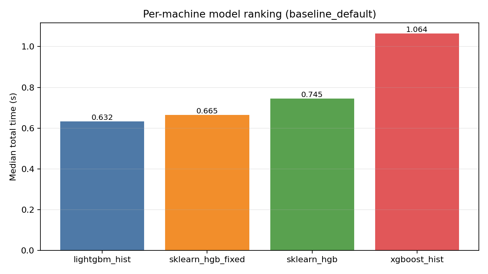
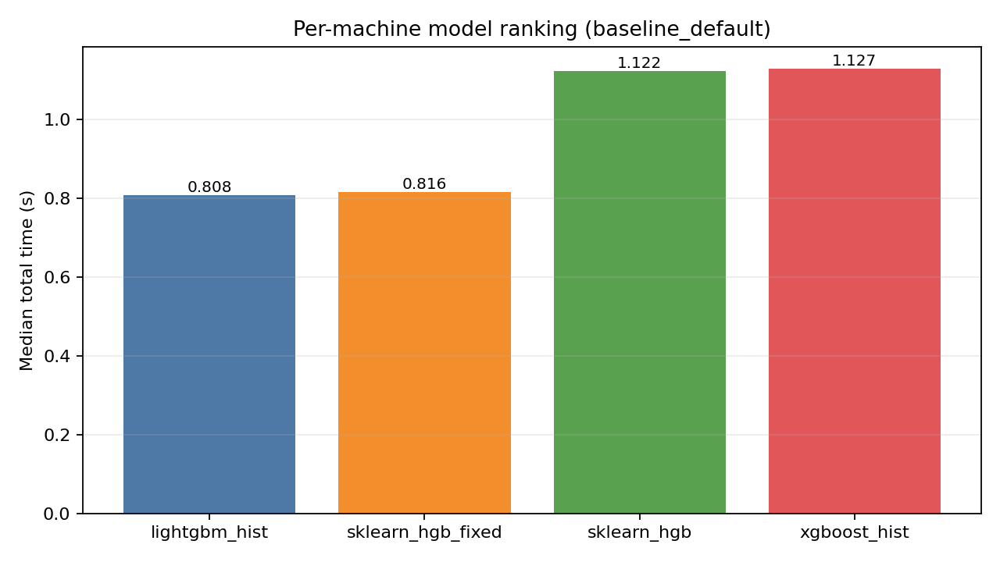
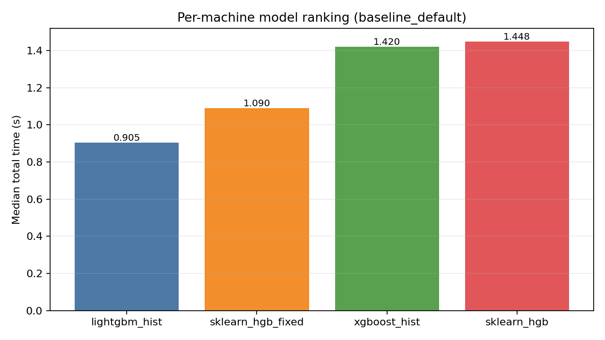
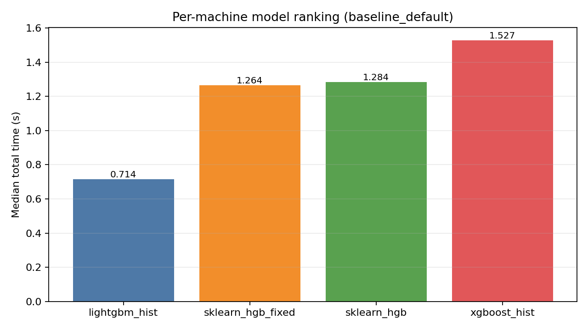

# HGBDT performance analysis study

This project benchmarks and profiles:

- `scikit-learn` `HistGradientBoostingRegressor`
- `xgboost` histogram trees
- `lightgbm` histogram trees

with aligned constraints and machine-scoped artifact collection.

## Scope

- Reproducible benchmark harness with timeout-aware adaptive dataset sizing.
- Cross-library comparability checks (R² spread, fitted-tree parity, and node-count parity).
- Thread scalability analysis and profile extraction.
- CI matrix reruns across Linux/macOS/Windows with artifact consolidation.

Core scripts:

- `benchmark_gbdt_regressors.py`
- `analyze_benchmark_results.py`
- `run_ci_benchmarks_profiles.py`
- `consolidate_ci_results.py`
- `generate_platform_detailed_analysis.py`

## Artifact layout

Per-machine outputs are consolidated under:

- `artifacts/machines/linux-amd64/`
- `artifacts/machines/linux-arm64/`
- `artifacts/machines/macos-arm64/`
- `artifacts/machines/windows-amd64/`

Cross-platform summaries:

- `artifacts/platform_specific_summary.json`
- `artifacts/platform_specific_conclusions.md`
- `artifacts/platform_detailed_analysis_index.md`

## CI workflow

Workflow file: `.github/workflows/benchmark-profiling-matrix.yml`

The matrix uploads:

- per-machine artifacts: `benchmark-profiles-<machine-tag>`
- consolidated bundle: `benchmark-profiles-consolidated`

CI matrix jobs use the `ci_balanced` benchmark profile only (datasets: `small`, `medium`), run all benchmark scenarios in subprocesses, evaluate thread regimes `1`, `cores/2`, `cores`, and `2x-cores`, and keep the CI pass baseline-only (`--skip-alt-hparams`) to preserve informative diagnostics within runtime budget.

## Collecting CI outputs into the repo

Download artifacts from a run:

- `gh run download <run-id> --dir /tmp/hgbdt-ci-artifacts`

Consolidate:

- `uv run --python 3.11 --exclude-newer P7D python consolidate_ci_results.py --downloaded-artifacts-root /tmp/hgbdt-ci-artifacts --artifacts-root artifacts`

Generate detailed reports:

- `uv run --python 3.11 --exclude-newer P7D python generate_platform_detailed_analysis.py --artifacts-root artifacts`

## Main conclusions

1. `lightgbm_hist` is top-ranked by median total runtime on all current CI platforms for this benchmark profile.
2. `lightgbm_hist` leads mono-thread runtime and most `1 -> cores` scaling cases, while `sklearn_hgb_fixed` is strongest in oversubscribed `2x cores` robustness.
3. Despite stable top ranking, model sensitivity to platform remains high and is tracked via per-model worst/best ratios.

### Per-platform benchmark plots

These plots show median total runtime ranking (lower is better):

- **linux-amd64** (winner: `lightgbm_hist`)
  - 
- **linux-arm64** (winner: `lightgbm_hist`)
  - 
- **macos-arm64** (winner: `lightgbm_hist`)
  - 
- **windows-amd64** (winner: `lightgbm_hist`)
  - 

### Cross-platform contrast and platform-specific variations

From `artifacts/platform_specific_summary.json`:

- Winner split:
  - `lightgbm_hist`: 4/4 platforms
- Slowest model:
  - `xgboost_hist`: 3/4 platforms
  - `sklearn_hgb`: 1/4 platforms
- Worst/best median runtime ratio by model:
  - `lightgbm_hist`: `1.431x`
  - `sklearn_hgb`: `1.942x`
  - `sklearn_hgb_fixed`: `1.899x`
  - `xgboost_hist`: `1.435x`
- Profiling coverage note:
  - Windows artifacts are generated without native py-spy (`native_profile_enabled=false`), while Linux/macOS include native profile snapshots.

### Cross-platform comparison by performance regime

Regime summaries below are computed from the latest consolidated CI artifacts across datasets (`small`, `medium`) using the CI baseline setting (`baseline_default`).

#### 1) Mono-thread performance (`threads=1`, lower `total_seconds` is better)

- Most frequent winner by platform: `lightgbm_hist` (3/4 platforms), with `sklearn_hgb_fixed` leading on linux-amd64.
- Global median `total_seconds` across all runs:
  - `lightgbm_hist`: `0.8296s`
  - `sklearn_hgb_fixed`: `1.0727s`
  - `sklearn_hgb`: `1.0797s`
  - `xgboost_hist`: `1.5056s`

#### 2) Regular-regime scalability (`1 -> cores`, higher `fit_speedup` is better)

- Most frequent winner by platform: `lightgbm_hist` (3/4 platforms), with `sklearn_hgb` leading on macos-arm64.
- Global median `fit_speedup(1->cores)`:
  - `lightgbm_hist`: `2.0246x`
  - `xgboost_hist`: `1.5421x`
  - `sklearn_hgb`: `1.4230x`
  - `sklearn_hgb_fixed`: `1.3713x`

#### 3) Oversubscription robustness (`2x cores / cores`, lower fit-time ratio is better)

- Most frequent winner by platform: `sklearn_hgb_fixed` (4/4 platforms).
- Global median `fit_time_ratio(2x_vs_cores)`:
  - `sklearn_hgb_fixed`: `0.9988x`
  - `xgboost_hist`: `1.0014x`
  - `lightgbm_hist`: `2.4082x`
  - `sklearn_hgb`: `3.4240x`

Interpretation: `lightgbm_hist` is the consistent non-oversubscribed throughput leader, while `sklearn_hgb_fixed` and `xgboost_hist` remain substantially more resilient than `lightgbm_hist` and especially `sklearn_hgb` under `2x cores` oversubscription.

## Per-platform detailed analysis (root causes + implementation plans)

- Index: [platform detailed analysis index](artifacts/platform_detailed_analysis_index.md)
- linux-amd64: [detailed analysis](artifacts/machines/linux-amd64/detailed_analysis.md)
- linux-arm64: [detailed analysis](artifacts/machines/linux-arm64/detailed_analysis.md)
- macos-arm64: [detailed analysis](artifacts/machines/macos-arm64/detailed_analysis.md)
- windows-amd64: [detailed analysis](artifacts/machines/windows-amd64/detailed_analysis.md)

Each detailed report includes:

- Scalability plots for available settings:
  - `baseline_default` (`scalability.png`)
  - optional `deep_few_trees` (`scalability_deep_few_trees.png`) when present in artifacts
- Absolute fit-time plots for available settings:
  - `baseline_default` (`fit_time_threads.png`)
  - optional `deep_few_trees` (`fit_time_threads_deep_few_trees.png`) when present in artifacts
  - Vertical markers annotate `cores=<n>` and `2x=<2n>` regimes.
- Oversubscription regime tables at `cores` and `2x cores`.
- Measured per-model `r2` parity tables.
- Effective tree-count and node-per-tree parity checks (`fitted_trees`, `expected_trees`, `total_nodes`, `avg_nodes_per_tree`).
- Machine metadata (`logical/physical` CPU counts, core-type breakdown, hyper-threading flag, CFS quota, and cpuset when available).
- Root-cause diagnostics for sklearn single-thread/scalability underperformance when detected, plus implementation plans for each issue.
