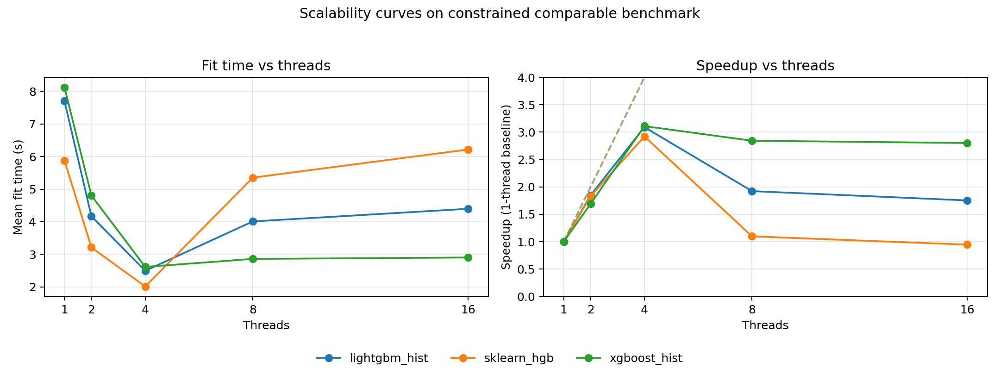
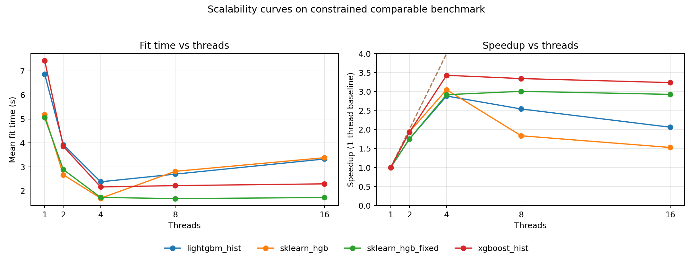
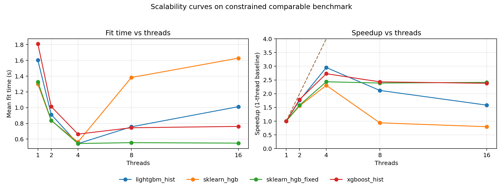
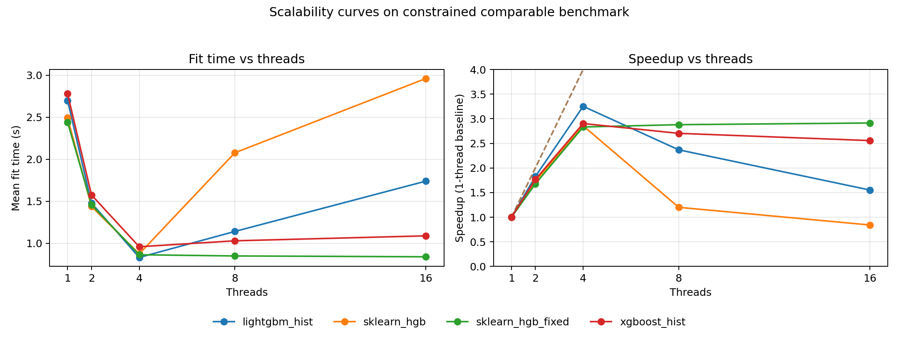

# HGBDT performance analysis study

This folder contains the complete benchmarking, profiling, and analysis work for comparing:

- `scikit-learn` `HistGradientBoostingRegressor`
- `xgboost` histogram trees
- `lightgbm` histogram trees

under aligned hyperparameters, aligned fitted-tree counts, and controlled runtime budgets.

## Scope

- Build a reproducible benchmark harness with timeout-aware adaptive dataset sizing.
- Enforce cross-library comparability:
  - matched hyperparameters,
  - R² parity checks,
  - fitted-tree parity checks (early stopping disabled where needed).
- Measure scalability from 1 thread to oversubscription regimes.
- Profile hotspots at Python and native levels.
- Identify root causes for slowdowns and propose implementation strategies.

Core scripts:

- [`benchmark_gbdt_regressors.py`](benchmark_gbdt_regressors.py)
- [`aligned_large_comparison.py`](aligned_large_comparison.py)
- [`plot_scalability_curves.py`](plot_scalability_curves.py)
- [`calibrate_shared_hyperparams.py`](calibrate_shared_hyperparams.py)
- [`focused_sklearn_vs_lightgbm.py`](focused_sklearn_vs_lightgbm.py)
- [`analyze_benchmark_results.py`](analyze_benchmark_results.py)
- [`extract_profile_insights.py`](extract_profile_insights.py)
- [`run_ci_benchmarks_profiles.py`](run_ci_benchmarks_profiles.py)
- [`consolidate_ci_results.py`](consolidate_ci_results.py)

## Machine-scoped artifact layout

Benchmark and profiling outputs are written to machine-specific folders:

- `artifacts/machines/linux-amd64/`
- `artifacts/machines/linux-arm64/`
- `artifacts/machines/macos-arm64/`
- `artifacts/machines/windows-amd64/`

Each script accepts:

- `--artifacts-root` (base output directory, defaults to `artifacts/`)
- `--machine-tag` (override machine subfolder; otherwise auto-detected from OS + arch)

## CI matrix reruns (macOS/Linux/Windows)

Workflow: [`.github/workflows/benchmark-profiling-matrix.yml`](../.github/workflows/benchmark-profiling-matrix.yml)

It runs benchmark + profiling collection on:

- Linux amd64 (`ubuntu-24.04`)
- Linux arm64 (`ubuntu-24.04-arm`)
- macOS arm64 (`macos-14`)
- Windows amd64 (`windows-2022`)

The workflow uploads per-machine artifacts (`benchmark-profiles-<machine-tag>`) and a consolidated bundle (`benchmark-profiles-consolidated`) that includes machine subfolders plus cross-platform summary files.

## Consolidating downloadable CI artifacts into the repo

Download artifacts from a workflow run:

- `gh run download <run-id> --dir /tmp/hgbdt-ci-artifacts`

Consolidate and regenerate platform conclusions:

- `uv run --python 3.11 --exclude-newer P7D python consolidate_ci_results.py --downloaded-artifacts-root /tmp/hgbdt-ci-artifacts --artifacts-root artifacts`

This updates:

- `artifacts/machines/<machine-tag>/...`
- `artifacts/platform_specific_summary.json`
- `artifacts/platform_specific_conclusions.md`

## Main conclusions

1. **With aligned constraints, relative rankings depend on regime, but oversubscription harms sklearn most without mitigation.**
   - Oversubscription validation and diagnostics:
     - [`artifacts/oversubscription_fix_validation.md`](artifacts/oversubscription_fix_validation.md)
     - [`artifacts/oversubscription_overhead_report.md`](artifacts/oversubscription_overhead_report.md)
     - [`artifacts/oversubscription_context_switches.json`](artifacts/oversubscription_context_switches.json)
     - [`artifacts/oversubscription_wait_policy_results.json`](artifacts/oversubscription_wait_policy_results.json)
   - Main scalability view:
     - 

2. **A simple thread-capping mitigation for sklearn avoids catastrophic oversubscription behavior.**
   - Patch and summary:
     - [`artifacts/sklearn_histgb_thread_cap.patch`](artifacts/sklearn_histgb_thread_cap.patch)
     - [`artifacts/oversubscription_fix_report.md`](artifacts/oversubscription_fix_report.md)
   - With-fix comparisons:
     - 
     - 

3. **A parity-compliant setting exists where sklearn is significantly slower than LightGBM at 4 threads.**
   - Evidence:
     - [`artifacts/sklearn_slow_4threads_setting.md`](artifacts/sklearn_slow_4threads_setting.md)
     - [`artifacts/sklearn_slow_4threads_setting.json`](artifacts/sklearn_slow_4threads_setting.json)
     - [`artifacts/sklearn_slow_4threads_top10_multiseed.json`](artifacts/sklearn_slow_4threads_top10_multiseed.json)

4. **For that setting, profiler evidence points to fine-grained per-node orchestration/synchronization overhead in sklearn.**
   - Profile summary and root-cause write-up:
     - [`artifacts/profile_slowdown_setting_summary.json`](artifacts/profile_slowdown_setting_summary.json)
     - [`artifacts/profile_slowdown_setting_root_cause.md`](artifacts/profile_slowdown_setting_root_cause.md)

5. **In the deep-few-trees regime, sklearn leads at 1-2 threads while LightGBM is fastest at 4 threads.**
   - Regime analysis and data:
     - [`artifacts/deep_few_trees_report.md`](artifacts/deep_few_trees_report.md)
     - [`artifacts/deep_few_trees_analysis.md`](artifacts/deep_few_trees_analysis.md)
     - [`artifacts/deep_few_trees_results.json`](artifacts/deep_few_trees_results.json)
     - [`artifacts/deep_few_trees_scalability_data.json`](artifacts/deep_few_trees_scalability_data.json)
     - 

6. **Cross-platform conclusions are explicitly scoped by machine.**
   - Consolidated report files:
     - [`artifacts/platform_specific_summary.json`](artifacts/platform_specific_summary.json)
     - [`artifacts/platform_specific_conclusions.md`](artifacts/platform_specific_conclusions.md)

### Per-platform benchmark plots (CI run `25507886240`)

These plots summarize median total runtime ranking (lower is better) on each CI platform:

- **linux-amd64** (winner: `sklearn_hgb`)
  - 
- **linux-arm64** (winner: `lightgbm_hist`)
  - 
- **macos-arm64** (winner: `sklearn_hgb_fixed`)
  - 
- **windows-amd64** (winner: `lightgbm_hist`)
  - 

### Cross-platform contrast and platform-specific variations

Using [`artifacts/platform_specific_summary.json`](artifacts/platform_specific_summary.json):

- The winner is **not stable across platforms**:
  - `lightgbm_hist` wins 2/4 (linux-arm64, windows-amd64),
  - `sklearn_hgb` wins 1/4 (linux-amd64),
  - `sklearn_hgb_fixed` wins 1/4 (macos-arm64).
- `xgboost_hist` is the slowest model on all 4 platforms in this benchmark configuration.
- Cross-platform runtime sensitivity (worst/best median total time ratio):
  - `sklearn_hgb`: **1.684x**
  - `sklearn_hgb_fixed`: **1.664x**
  - `lightgbm_hist`: **1.578x**
  - `xgboost_hist`: **1.430x**
- Windows artifacts are generated without native py-spy profiling (`native_profile_enabled=false`), while Linux/macOS include native stack snapshots.

## Implementation strategy to improve sklearn efficiency (for the slow setting)

Priority plan:

1. **Adaptive per-node thread selection** in grow/split/hist paths to reduce short-region OpenMP overhead on small nodes.
2. **Small-node serial fast path** in `split_indices` to bypass two-phase `prange + memcpy` machinery when node work is tiny.
3. **Scratch-buffer reuse** in `split_indices` and `find_node_split` to avoid frequent allocations in hot loops.
4. **Optional phase 2:** mini-batch processing of multiple frontier nodes to increase task granularity.

Rationale and evidence links:

- Root cause from profiling:
  - [`artifacts/profile_slowdown_setting_root_cause.md`](artifacts/profile_slowdown_setting_root_cause.md)
  - [`artifacts/profile_slowdown_setting_summary.json`](artifacts/profile_slowdown_setting_summary.json)
- Existing oversubscription implementation analysis:
  - [`artifacts/oversubscription_xgboost_vs_sklearn_impl_analysis.md`](artifacts/oversubscription_xgboost_vs_sklearn_impl_analysis.md)

## Additional reports and data

- Comparable aligned large-run outputs:
  - [`artifacts/comparable_large_report.md`](artifacts/comparable_large_report.md)
  - [`artifacts/comparable_large_results.json`](artifacts/comparable_large_results.json)
  - [`artifacts/comparable_large_params.json`](artifacts/comparable_large_params.json)
- Deep-few-trees regime:
  - [`artifacts/deep_few_trees_report.md`](artifacts/deep_few_trees_report.md)
  - [`artifacts/deep_few_trees_analysis.md`](artifacts/deep_few_trees_analysis.md)
  - [`artifacts/deep_few_trees_results.json`](artifacts/deep_few_trees_results.json)
  - [`artifacts/deep_few_trees_scalability_data.json`](artifacts/deep_few_trees_scalability_data.json)
  - [`artifacts/deep_few_trees_scalability.png`](artifacts/deep_few_trees_scalability.png)
# HGBDT performance analysis study

This folder contains the complete benchmarking, profiling, and analysis work for comparing:

- `scikit-learn` `HistGradientBoostingRegressor`
- `xgboost` histogram trees
- `lightgbm` histogram trees

under aligned hyperparameters, aligned fitted-tree counts, and controlled runtime budgets.

## Scope

- Build a reproducible benchmark harness with timeout-aware adaptive dataset sizing.
- Enforce cross-library comparability:
  - matched hyperparameters,
  - R² parity checks,
  - fitted-tree parity checks (early stopping disabled where needed).
- Measure scalability from 1 thread to oversubscription regimes.
- Profile hotspots at Python and native levels.
- Identify root causes for slowdowns and propose implementation strategies.

Core scripts:

- [`benchmark_gbdt_regressors.py`](benchmark_gbdt_regressors.py)
- [`aligned_large_comparison.py`](aligned_large_comparison.py)
- [`plot_scalability_curves.py`](plot_scalability_curves.py)
- [`calibrate_shared_hyperparams.py`](calibrate_shared_hyperparams.py)
- [`focused_sklearn_vs_lightgbm.py`](focused_sklearn_vs_lightgbm.py)
- [`analyze_benchmark_results.py`](analyze_benchmark_results.py)
- [`extract_profile_insights.py`](extract_profile_insights.py)

## Main conclusions

1. **With aligned constraints, relative rankings depend on regime, but oversubscription harms sklearn most without mitigation.**
   - Oversubscription validation and diagnostics:
     - [`artifacts/oversubscription_fix_validation.md`](artifacts/oversubscription_fix_validation.md)
     - [`artifacts/oversubscription_overhead_report.md`](artifacts/oversubscription_overhead_report.md)
     - [`artifacts/oversubscription_context_switches.json`](artifacts/oversubscription_context_switches.json)
     - [`artifacts/oversubscription_wait_policy_results.json`](artifacts/oversubscription_wait_policy_results.json)
   - Main scalability view (1..16 threads):

     

2. **A simple thread-capping mitigation for sklearn avoids catastrophic oversubscription behavior.**
   - Patch and summary:
     - [`artifacts/sklearn_histgb_thread_cap.patch`](artifacts/sklearn_histgb_thread_cap.patch)
     - [`artifacts/oversubscription_fix_report.md`](artifacts/oversubscription_fix_report.md)
   - Large-dataset comparison with and without sklearn fix:

     

   - Small-dataset comparison with and without sklearn fix:

     

3. **A parity-compliant setting exists where sklearn is significantly slower than LightGBM at 4 threads.**
   - Confirmed setting and multi-seed evidence:
     - [`artifacts/sklearn_slow_4threads_setting.md`](artifacts/sklearn_slow_4threads_setting.md)
     - [`artifacts/sklearn_slow_4threads_setting.json`](artifacts/sklearn_slow_4threads_setting.json)
     - [`artifacts/sklearn_slow_4threads_top10_multiseed.json`](artifacts/sklearn_slow_4threads_top10_multiseed.json)

4. **For that setting, profiler evidence points to fine-grained per-node orchestration/synchronization overhead in sklearn.**
   - Profile summary and root-cause write-up:
     - [`artifacts/profile_slowdown_setting_summary.json`](artifacts/profile_slowdown_setting_summary.json)
     - [`artifacts/profile_slowdown_setting_root_cause.md`](artifacts/profile_slowdown_setting_root_cause.md)
   - Extended implementation comparison:
     - [`artifacts/oversubscription_xgboost_vs_sklearn_impl_analysis.md`](artifacts/oversubscription_xgboost_vs_sklearn_impl_analysis.md)

5. **In the deep-few-trees regime, sklearn leads at 1-2 threads while LightGBM is fastest at 4 threads.**
   - Regime analysis and data:
     - [`artifacts/deep_few_trees_report.md`](artifacts/deep_few_trees_report.md)
     - [`artifacts/deep_few_trees_analysis.md`](artifacts/deep_few_trees_analysis.md)
     - [`artifacts/deep_few_trees_results.json`](artifacts/deep_few_trees_results.json)
     - [`artifacts/deep_few_trees_scalability_data.json`](artifacts/deep_few_trees_scalability_data.json)

     

## Implementation strategy to improve sklearn efficiency (for the slow setting)

Priority plan:

1. **Adaptive per-node thread selection** in grow/split/hist paths to reduce short-region OpenMP overhead on small nodes.
2. **Small-node serial fast path** in `split_indices` to bypass two-phase `prange + memcpy` machinery when node work is tiny.
3. **Scratch-buffer reuse** in `split_indices` and `find_node_split` to avoid frequent allocations in hot loops.
4. **Optional phase 2:** mini-batch processing of multiple frontier nodes to increase task granularity.

Rationale and evidence links:

- Root cause from profiling:
  - [`artifacts/profile_slowdown_setting_root_cause.md`](artifacts/profile_slowdown_setting_root_cause.md)
  - [`artifacts/profile_slowdown_setting_summary.json`](artifacts/profile_slowdown_setting_summary.json)
- Existing oversubscription implementation analysis:
  - [`artifacts/oversubscription_xgboost_vs_sklearn_impl_analysis.md`](artifacts/oversubscription_xgboost_vs_sklearn_impl_analysis.md)

## Additional reports and data

- Comparable aligned large-run outputs:
  - [`artifacts/comparable_large_report.md`](artifacts/comparable_large_report.md)
  - [`artifacts/comparable_large_results.json`](artifacts/comparable_large_results.json)
  - [`artifacts/comparable_large_params.json`](artifacts/comparable_large_params.json)
- Deep-few-trees regime:
  - [`artifacts/deep_few_trees_report.md`](artifacts/deep_few_trees_report.md)
  - [`artifacts/deep_few_trees_analysis.md`](artifacts/deep_few_trees_analysis.md)
  - [`artifacts/deep_few_trees_results.json`](artifacts/deep_few_trees_results.json)
  - [`artifacts/deep_few_trees_scalability_data.json`](artifacts/deep_few_trees_scalability_data.json)
  - [`artifacts/deep_few_trees_scalability.png`](artifacts/deep_few_trees_scalability.png)
