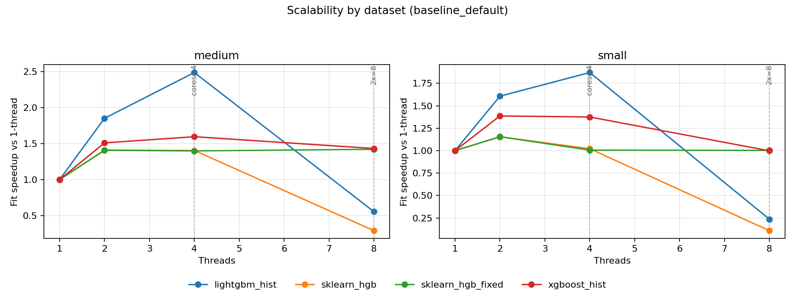
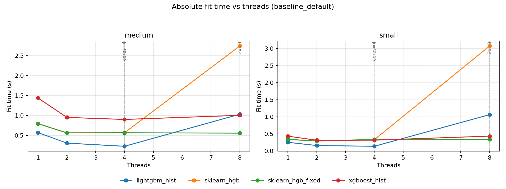
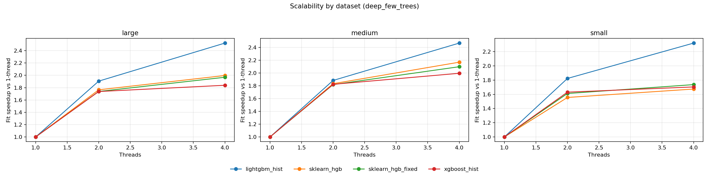
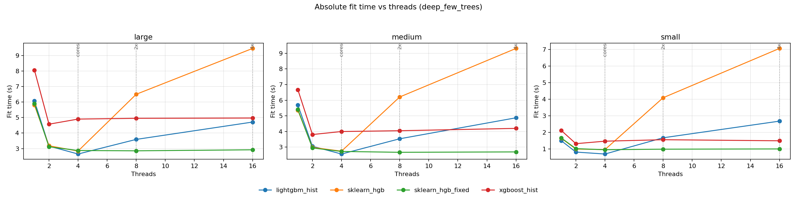

# Detailed platform analysis: linux-amd64

- System: `Linux`
- Architecture: `x86_64`
- CPU count (logical): `4`
- CPU count (physical): `2`
- Hyper-threading enabled: `True`
- CPU model: `AMD EPYC 7763 64-Core Processor`
- Core type counts: `{'performance': 4, 'efficiency': None, 'low_power': None}`
- CFS/CPU quota: `n/a`
- CPU set: `0-3`
- Thread grid: `[1, 2, 4, 8]`
- Native profile enabled: `True`

## Setting: `baseline_default`

_Vertical markers denote `cores=4` and `2x=8` thread regimes._

### Parity checks (thread=1)

| dataset | model | r2 | fitted_trees | expected_trees | trees_match | total_nodes | avg_nodes_per_tree |
| --- | --- | --- | --- | --- | --- | --- | --- |
| medium | lightgbm_hist | 0.508565 | 220 | 220 | True | 6114 | 27.7909 |
| medium | sklearn_hgb | 0.434502 | 220 | 220 | True | 7040 | 32 |
| medium | sklearn_hgb_fixed | 0.434502 | 220 | 220 | True | 7040 | 32 |
| medium | xgboost_hist | 0.47647 | 220 | 220 | True | 6168 | 28.0364 |
| small | lightgbm_hist | 0.866811 | 220 | 220 | True | 8348 | 37.9455 |
| small | sklearn_hgb | 0.838229 | 220 | 220 | True | 9210 | 41.8636 |
| small | sklearn_hgb_fixed | 0.838229 | 220 | 220 | True | 9210 | 41.8636 |
| small | xgboost_hist | 0.879536 | 220 | 220 | True | 8248 | 37.4909 |

### Scalability summary (`1 -> cores=4`)

| dataset | model | max_regular_threads | fit_s_1_thread | fit_s_regular_max_threads | speedup_1_to_regular_max |
| --- | --- | --- | --- | --- | --- |
| medium | lightgbm_hist | 4 | 0.573856 | 0.230871 | 2.48562 |
| medium | sklearn_hgb | 4 | 0.800289 | 0.569926 | 1.4042 |
| medium | sklearn_hgb_fixed | 4 | 0.796677 | 0.569771 | 1.39824 |
| medium | xgboost_hist | 4 | 1.44142 | 0.903604 | 1.59519 |
| small | lightgbm_hist | 4 | 0.250301 | 0.133782 | 1.87096 |
| small | sklearn_hgb | 4 | 0.33251 | 0.325469 | 1.02163 |
| small | sklearn_hgb_fixed | 4 | 0.335904 | 0.333909 | 1.00597 |
| small | xgboost_hist | 4 | 0.430639 | 0.313095 | 1.37543 |

### Oversubscription regime summary (`cores=4`, `2x`)

| dataset | model | fit_s_cores | fit_s_2x_cores | fit_ratio_2x_vs_cores |
| --- | --- | --- | --- | --- |
| medium | lightgbm_hist | 0.230871 | 1.03415 | 4.47935 |
| medium | sklearn_hgb | 0.569926 | 2.74507 | 4.81654 |
| medium | sklearn_hgb_fixed | 0.569771 | 0.560889 | 0.984412 |
| medium | xgboost_hist | 0.903604 | 1.00685 | 1.11426 |
| small | lightgbm_hist | 0.133782 | 1.06003 | 7.92357 |
| small | sklearn_hgb | 0.325469 | 3.07119 | 9.4362 |
| small | sklearn_hgb_fixed | 0.333909 | 0.335015 | 1.00331 |
| small | xgboost_hist | 0.313095 | 0.431329 | 1.37763 |

### Underperformance findings and root cause analysis

- Root cause signal: Native hotspots indicate synchronization/runtime overhead (OpenMP/pthread wait-heavy stacks).
- Issue (single_thread, dataset `medium`): Best sklearn total is 1.389x slower than best alternative at thread=1.
  - Implementation plan:
    - Introduce adaptive thread gating based on node sample count and feature count.
    - Batch multiple frontier nodes per parallel region to increase task granularity.
    - Reduce barrier frequency by fusing short OpenMP regions in split/histogram paths.
- Issue (single_thread, dataset `small`): Best sklearn total is 1.315x slower than best alternative at thread=1.
  - Implementation plan:
    - Introduce adaptive thread gating based on node sample count and feature count.
    - Batch multiple frontier nodes per parallel region to increase task granularity.
    - Reduce barrier frequency by fusing short OpenMP regions in split/histogram paths.
- Issue (scalability, dataset `medium`): Best sklearn speedup trails best alternative by 1.081 (1->regular max threads).
  - Implementation plan:
    - Introduce adaptive thread gating based on node sample count and feature count.
    - Batch multiple frontier nodes per parallel region to increase task granularity.
    - Reduce barrier frequency by fusing short OpenMP regions in split/histogram paths.
- Issue (scalability, dataset `small`): Best sklearn speedup trails best alternative by 0.849 (1->regular max threads).
  - Implementation plan:
    - Introduce adaptive thread gating based on node sample count and feature count.
    - Batch multiple frontier nodes per parallel region to increase task granularity.
    - Reduce barrier frequency by fusing short OpenMP regions in split/histogram paths.

## Setting: `deep_few_trees`

_Vertical markers denote `cores=4` and `2x=8` thread regimes._

### Parity checks (thread=1)

| dataset | model | r2 | fitted_trees | expected_trees | trees_match | total_nodes | avg_nodes_per_tree |
| --- | --- | --- | --- | --- | --- | --- | --- |
| large | lightgbm_hist | 0.491423 | 48 | 48 | True | 12144 | 253 |
| large | sklearn_hgb | 0.490287 | 48 | 48 | True | 12144 | 253 |
| large | sklearn_hgb_fixed | 0.490287 | 48 | 48 | True | 12144 | 253 |
| large | xgboost_hist | 0.491074 | 48 | 48 | True | 12144 | 253 |
| medium | lightgbm_hist | 0.56851 | 48 | 48 | True | 12144 | 253 |
| medium | sklearn_hgb | 0.568235 | 48 | 48 | True | 12144 | 253 |
| medium | sklearn_hgb_fixed | 0.568235 | 48 | 48 | True | 12144 | 253 |
| medium | xgboost_hist | 0.568178 | 48 | 48 | True | 12144 | 253 |
| small | lightgbm_hist | 0.749752 | 48 | 48 | True | 12144 | 253 |
| small | sklearn_hgb | 0.751461 | 48 | 48 | True | 12144 | 253 |
| small | sklearn_hgb_fixed | 0.751461 | 48 | 48 | True | 12144 | 253 |
| small | xgboost_hist | 0.752362 | 48 | 48 | True | 12144 | 253 |

### Scalability summary (`1 -> cores=4`)

| dataset | model | max_regular_threads | fit_s_1_thread | fit_s_regular_max_threads | speedup_1_to_regular_max |
| --- | --- | --- | --- | --- | --- |
| large | lightgbm_hist | 4 | 6.06889 | 2.65034 | 2.28985 |
| large | sklearn_hgb | 4 | 5.80408 | 2.84119 | 2.04283 |
| large | sklearn_hgb_fixed | 4 | 5.89654 | 2.87628 | 2.05006 |
| large | xgboost_hist | 4 | 8.06121 | 4.90204 | 1.64446 |
| medium | lightgbm_hist | 4 | 5.68987 | 2.56251 | 2.22043 |
| medium | sklearn_hgb | 4 | 5.35695 | 2.74419 | 1.95211 |
| medium | sklearn_hgb_fixed | 4 | 5.40238 | 2.72663 | 1.98134 |
| medium | xgboost_hist | 4 | 6.66734 | 3.99949 | 1.66705 |
| small | lightgbm_hist | 4 | 1.50059 | 0.702916 | 2.13481 |
| small | sklearn_hgb | 4 | 1.64966 | 0.969712 | 1.70118 |
| small | sklearn_hgb_fixed | 4 | 1.66552 | 0.962269 | 1.73083 |
| small | xgboost_hist | 4 | 2.11793 | 1.47587 | 1.43504 |

### Oversubscription regime summary (`cores=4`, `2x`)

| dataset | model | fit_s_cores | fit_s_2x_cores | fit_ratio_2x_vs_cores |
| --- | --- | --- | --- | --- |
| large | lightgbm_hist | 2.65034 | 3.59256 | 1.35551 |
| large | sklearn_hgb | 2.84119 | 6.5013 | 2.28823 |
| large | sklearn_hgb_fixed | 2.87628 | 2.85644 | 0.9931 |
| large | xgboost_hist | 4.90204 | 4.95196 | 1.01018 |
| medium | lightgbm_hist | 2.56251 | 3.53553 | 1.37971 |
| medium | sklearn_hgb | 2.74419 | 6.20535 | 2.26127 |
| medium | sklearn_hgb_fixed | 2.72663 | 2.67282 | 0.980264 |
| medium | xgboost_hist | 3.99949 | 4.05055 | 1.01277 |
| small | lightgbm_hist | 0.702916 | 1.68037 | 2.39056 |
| small | sklearn_hgb | 0.969712 | 4.09229 | 4.22011 |
| small | sklearn_hgb_fixed | 0.962269 | 0.99477 | 1.03378 |
| small | xgboost_hist | 1.47587 | 1.56456 | 1.06009 |

### Underperformance findings and root cause analysis

- Root cause signal: Native hotspots indicate synchronization/runtime overhead (OpenMP/pthread wait-heavy stacks).
- Issue (single_thread, dataset `small`): Best sklearn total is 1.088x slower than best alternative at thread=1.
  - Implementation plan:
    - Introduce adaptive thread gating based on node sample count and feature count.
    - Batch multiple frontier nodes per parallel region to increase task granularity.
    - Reduce barrier frequency by fusing short OpenMP regions in split/histogram paths.
- Issue (scalability, dataset `large`): Best sklearn speedup trails best alternative by 0.240 (1->regular max threads).
  - Implementation plan:
    - Introduce adaptive thread gating based on node sample count and feature count.
    - Batch multiple frontier nodes per parallel region to increase task granularity.
    - Reduce barrier frequency by fusing short OpenMP regions in split/histogram paths.
- Issue (scalability, dataset `medium`): Best sklearn speedup trails best alternative by 0.239 (1->regular max threads).
  - Implementation plan:
    - Introduce adaptive thread gating based on node sample count and feature count.
    - Batch multiple frontier nodes per parallel region to increase task granularity.
    - Reduce barrier frequency by fusing short OpenMP regions in split/histogram paths.
- Issue (scalability, dataset `small`): Best sklearn speedup trails best alternative by 0.404 (1->regular max threads).
  - Implementation plan:
    - Introduce adaptive thread gating based on node sample count and feature count.
    - Batch multiple frontier nodes per parallel region to increase task granularity.
    - Reduce barrier frequency by fusing short OpenMP regions in split/histogram paths.

