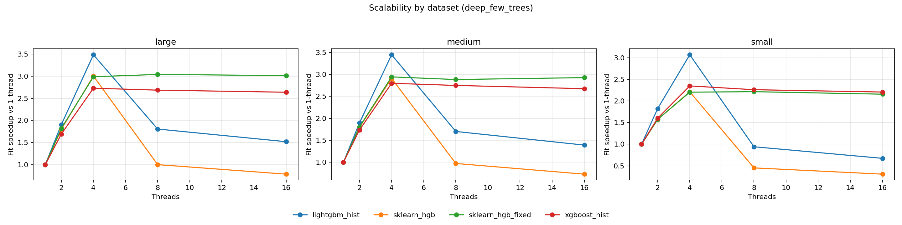

# Detailed platform analysis: linux-arm64

- System: `Linux`
- Architecture: `aarch64`
- CPU count (logical): `4`
- Thread grid: `[1, 2, 4, 8, 16]`
- Native profile enabled: `True`

## Setting: `baseline_default`

### Parity checks (thread=1)

| dataset | model | r2 | fitted_trees | expected_trees | trees_match | total_nodes | avg_nodes_per_tree |
| --- | --- | --- | --- | --- | --- | --- | --- |
| large | lightgbm_hist | 0.692337 | 220 | 220 | True | 13420 | 61 |
| large | sklearn_hgb | 0.675577 | 220 | 220 | True | 13420 | 61 |
| large | sklearn_hgb_fixed | 0.675577 | 220 | 220 | True | 13420 | 61 |
| large | xgboost_hist | 0.69332 | 220 | 220 | True | 13420 | 61 |
| medium | lightgbm_hist | 0.79359 | 220 | 220 | True | 13420 | 61 |
| medium | sklearn_hgb | 0.785099 | 220 | 220 | True | 13420 | 61 |
| medium | sklearn_hgb_fixed | 0.785099 | 220 | 220 | True | 13420 | 61 |
| medium | xgboost_hist | 0.793248 | 220 | 220 | True | 13420 | 61 |
| small | lightgbm_hist | 0.893078 | 220 | 220 | True | 13420 | 61 |
| small | sklearn_hgb | 0.88762 | 220 | 220 | True | 13420 | 61 |
| small | sklearn_hgb_fixed | 0.88762 | 220 | 220 | True | 13420 | 61 |
| small | xgboost_hist | 0.894341 | 220 | 220 | True | 13420 | 61 |

### Scalability summary

| dataset | model | max_threads | fit_s_1_thread | fit_s_max_threads | speedup_1_to_max |
| --- | --- | --- | --- | --- | --- |
| large | lightgbm_hist | 16 | 4.96354 | 3.45726 | 1.43569 |
| large | sklearn_hgb | 16 | 5.37252 | 6.77556 | 0.792927 |
| large | sklearn_hgb_fixed | 16 | 5.28029 | 1.78273 | 2.96192 |
| large | xgboost_hist | 16 | 7.49242 | 2.7905 | 2.68498 |
| medium | lightgbm_hist | 16 | 4.79567 | 3.36004 | 1.42727 |
| medium | sklearn_hgb | 16 | 5.17056 | 6.77116 | 0.763615 |
| medium | sklearn_hgb_fixed | 16 | 5.16941 | 1.69812 | 3.0442 |
| medium | xgboost_hist | 16 | 6.53213 | 2.35846 | 2.76966 |
| small | lightgbm_hist | 16 | 1.92317 | 2.36159 | 0.814352 |
| small | sklearn_hgb | 16 | 2.20763 | 5.59956 | 0.394251 |
| small | sklearn_hgb_fixed | 16 | 2.21866 | 0.93716 | 2.36743 |
| small | xgboost_hist | 16 | 2.60308 | 1.09323 | 2.38109 |

### Oversubscription regime summary (`cores=4`, `2x`, `4x`)

| dataset | model | fit_s_cores | fit_s_2x_cores | fit_s_4x_cores | fit_ratio_2x_vs_cores | fit_ratio_4x_vs_cores |
| --- | --- | --- | --- | --- | --- | --- |
| large | lightgbm_hist | 1.39884 | 2.77911 | 3.45726 | 1.98673 | 2.47153 |
| large | sklearn_hgb | 1.80386 | 5.23829 | 6.77556 | 2.90394 | 3.75614 |
| large | sklearn_hgb_fixed | 1.78171 | 1.81432 | 1.78273 | 1.01831 | 1.00057 |
| large | xgboost_hist | 2.80017 | 2.75006 | 2.7905 | 0.982103 | 0.996544 |
| medium | lightgbm_hist | 1.39673 | 2.81992 | 3.36004 | 2.01894 | 2.40565 |
| medium | sklearn_hgb | 1.76414 | 5.20975 | 6.77116 | 2.95313 | 3.83822 |
| medium | sklearn_hgb_fixed | 1.81645 | 1.74789 | 1.69812 | 0.962257 | 0.934856 |
| medium | xgboost_hist | 2.25705 | 2.34713 | 2.35846 | 1.03991 | 1.04493 |
| small | lightgbm_hist | 0.638201 | 1.74466 | 2.36159 | 2.73371 | 3.70039 |
| small | sklearn_hgb | 0.964794 | 3.84797 | 5.59956 | 3.98839 | 5.80389 |
| small | sklearn_hgb_fixed | 0.941998 | 0.921488 | 0.93716 | 0.978227 | 0.994865 |
| small | xgboost_hist | 1.03088 | 1.10644 | 1.09323 | 1.0733 | 1.06048 |

### Underperformance findings and root cause analysis

- Root cause signal: Native hotspots indicate synchronization/runtime overhead (OpenMP/pthread wait-heavy stacks).
- Issue (single_thread, dataset `large`): Best sklearn total is 1.064x slower than best alternative at thread=1.
  - Implementation plan:
    - Introduce adaptive thread gating based on node sample count and feature count.
    - Batch multiple frontier nodes per parallel region to increase task granularity.
    - Reduce barrier frequency by fusing short OpenMP regions in split/histogram paths.
- Issue (single_thread, dataset `medium`): Best sklearn total is 1.076x slower than best alternative at thread=1.
  - Implementation plan:
    - Introduce adaptive thread gating based on node sample count and feature count.
    - Batch multiple frontier nodes per parallel region to increase task granularity.
    - Reduce barrier frequency by fusing short OpenMP regions in split/histogram paths.
- Issue (single_thread, dataset `small`): Best sklearn total is 1.132x slower than best alternative at thread=1.
  - Implementation plan:
    - Introduce adaptive thread gating based on node sample count and feature count.
    - Batch multiple frontier nodes per parallel region to increase task granularity.
    - Reduce barrier frequency by fusing short OpenMP regions in split/histogram paths.

## Setting: `deep_few_trees`

### Parity checks (thread=1)

| dataset | model | r2 | fitted_trees | expected_trees | trees_match | total_nodes | avg_nodes_per_tree |
| --- | --- | --- | --- | --- | --- | --- | --- |
| large | lightgbm_hist | 0.491423 | 48 | 48 | True | 12144 | 253 |
| large | sklearn_hgb | 0.490287 | 48 | 48 | True | 12144 | 253 |
| large | sklearn_hgb_fixed | 0.490287 | 48 | 48 | True | 12144 | 253 |
| large | xgboost_hist | 0.491074 | 48 | 48 | True | 12144 | 253 |
| medium | lightgbm_hist | 0.56851 | 48 | 48 | True | 12144 | 253 |
| medium | sklearn_hgb | 0.568235 | 48 | 48 | True | 12144 | 253 |
| medium | sklearn_hgb_fixed | 0.568235 | 48 | 48 | True | 12144 | 253 |
| medium | xgboost_hist | 0.568178 | 48 | 48 | True | 12144 | 253 |
| small | lightgbm_hist | 0.749752 | 48 | 48 | True | 12144 | 253 |
| small | sklearn_hgb | 0.751461 | 48 | 48 | True | 12144 | 253 |
| small | sklearn_hgb_fixed | 0.751461 | 48 | 48 | True | 12144 | 253 |
| small | xgboost_hist | 0.752362 | 48 | 48 | True | 12144 | 253 |

### Scalability summary

| dataset | model | max_threads | fit_s_1_thread | fit_s_max_threads | speedup_1_to_max |
| --- | --- | --- | --- | --- | --- |
| large | lightgbm_hist | 16 | 5.62466 | 3.69919 | 1.52051 |
| large | sklearn_hgb | 16 | 6.10667 | 7.75127 | 0.787829 |
| large | sklearn_hgb_fixed | 16 | 6.17271 | 2.04974 | 3.01147 |
| large | xgboost_hist | 16 | 7.68508 | 2.91475 | 2.63662 |
| medium | lightgbm_hist | 16 | 5.44555 | 3.91131 | 1.39226 |
| medium | sklearn_hgb | 16 | 5.77285 | 7.8907 | 0.731602 |
| medium | sklearn_hgb_fixed | 16 | 5.75135 | 1.96544 | 2.92624 |
| medium | xgboost_hist | 16 | 6.58752 | 2.46293 | 2.67466 |
| small | lightgbm_hist | 16 | 1.36578 | 2.02845 | 0.673313 |
| small | sklearn_hgb | 16 | 1.76322 | 5.72692 | 0.307882 |
| small | sklearn_hgb_fixed | 16 | 1.76394 | 0.817898 | 2.15667 |
| small | xgboost_hist | 16 | 2.00587 | 0.909308 | 2.20594 |

### Oversubscription regime summary (`cores=4`, `2x`, `4x`)

| dataset | model | fit_s_cores | fit_s_2x_cores | fit_s_4x_cores | fit_ratio_2x_vs_cores | fit_ratio_4x_vs_cores |
| --- | --- | --- | --- | --- | --- | --- |
| large | lightgbm_hist | 1.61528 | 3.11482 | 3.69919 | 1.92835 | 2.29013 |
| large | sklearn_hgb | 2.03369 | 6.09084 | 7.75127 | 2.99498 | 3.81144 |
| large | sklearn_hgb_fixed | 2.06758 | 2.03133 | 2.04974 | 0.982464 | 0.991368 |
| large | xgboost_hist | 2.81736 | 2.86368 | 2.91475 | 1.01644 | 1.03457 |
| medium | lightgbm_hist | 1.58035 | 3.19939 | 3.91131 | 2.02448 | 2.47496 |
| medium | sklearn_hgb | 1.98398 | 5.9252 | 7.8907 | 2.98652 | 3.9772 |
| medium | sklearn_hgb_fixed | 1.95425 | 1.99507 | 1.96544 | 1.02089 | 1.00573 |
| medium | xgboost_hist | 2.35491 | 2.39664 | 2.46293 | 1.01772 | 1.04587 |
| small | lightgbm_hist | 0.44519 | 1.451 | 2.02845 | 3.25927 | 4.55636 |
| small | sklearn_hgb | 0.797344 | 3.89791 | 5.72692 | 4.88861 | 7.18249 |
| small | sklearn_hgb_fixed | 0.800657 | 0.796612 | 0.817898 | 0.994948 | 1.02153 |
| small | xgboost_hist | 0.854459 | 0.88744 | 0.909308 | 1.0386 | 1.06419 |

### Underperformance findings and root cause analysis

- Root cause signal: Native hotspots indicate synchronization/runtime overhead (OpenMP/pthread wait-heavy stacks).
- Issue (single_thread, dataset `large`): Best sklearn total is 1.086x slower than best alternative at thread=1.
  - Implementation plan:
    - Introduce adaptive thread gating based on node sample count and feature count.
    - Batch multiple frontier nodes per parallel region to increase task granularity.
    - Reduce barrier frequency by fusing short OpenMP regions in split/histogram paths.
- Issue (single_thread, dataset `medium`): Best sklearn total is 1.054x slower than best alternative at thread=1.
  - Implementation plan:
    - Introduce adaptive thread gating based on node sample count and feature count.
    - Batch multiple frontier nodes per parallel region to increase task granularity.
    - Reduce barrier frequency by fusing short OpenMP regions in split/histogram paths.
- Issue (single_thread, dataset `small`): Best sklearn total is 1.272x slower than best alternative at thread=1.
  - Implementation plan:
    - Introduce adaptive thread gating based on node sample count and feature count.
    - Batch multiple frontier nodes per parallel region to increase task granularity.
    - Reduce barrier frequency by fusing short OpenMP regions in split/histogram paths.

