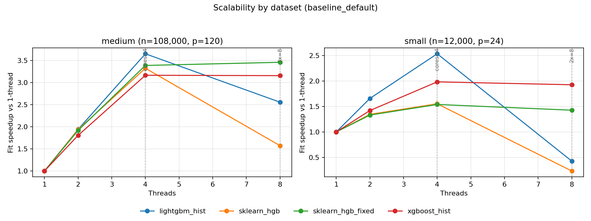
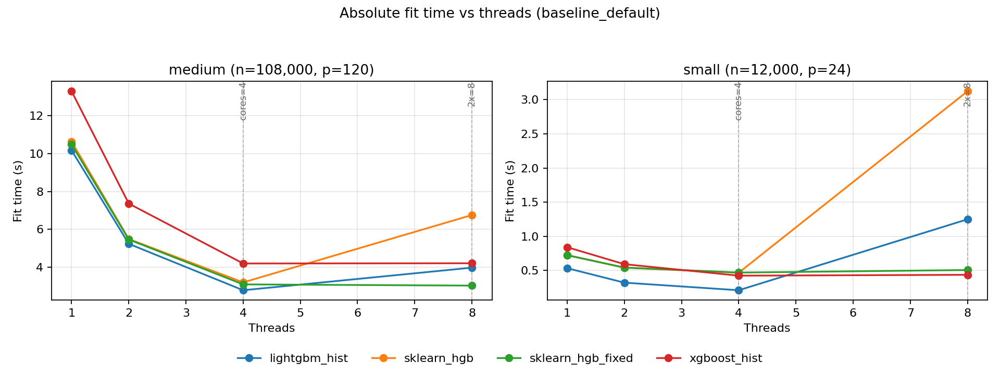

# Detailed platform analysis: linux-arm64

- System: `Linux`
- Architecture: `aarch64`
- CPU count (logical): `4`
- CPU count (physical): `4`
- Hyper-threading enabled: `False`
- CPU model: `Neoverse-N2`
- Core type counts: `{'performance': 4, 'efficiency': None, 'low_power': None}`
- CFS/CPU quota: `n/a`
- CPU set: `0-3`
- Thread grid: `[1, 2, 4, 8]`
- Native profile enabled: `True`

## Setting: `baseline_default`

_Vertical markers denote `cores=4` and `2x=8` thread regimes._

### Parity checks (thread=1)

| dataset | model | r2 | fitted_trees | expected_trees | trees_match | total_nodes | avg_nodes_per_tree |
| --- | --- | --- | --- | --- | --- | --- | --- |
| medium | lightgbm_hist | 0.66215 | 220 | 220 | True | 13326 | 60.5727 |
| medium | sklearn_hgb | 0.634085 | 220 | 220 | True | 13402 | 60.9182 |
| medium | sklearn_hgb_fixed | 0.634085 | 220 | 220 | True | 13402 | 60.9182 |
| medium | xgboost_hist | 0.661463 | 220 | 220 | True | 13336 | 60.6182 |
| small | lightgbm_hist | 0.949369 | 220 | 220 | True | 13386 | 60.8455 |
| small | sklearn_hgb | 0.942299 | 220 | 220 | True | 13414 | 60.9727 |
| small | sklearn_hgb_fixed | 0.942299 | 220 | 220 | True | 13414 | 60.9727 |
| small | xgboost_hist | 0.949753 | 220 | 220 | True | 13390 | 60.8636 |

### Scalability summary (`1 -> cores=4`)

| dataset | model | max_regular_threads | fit_s_1_thread | fit_s_regular_max_threads | speedup_1_to_regular_max |
| --- | --- | --- | --- | --- | --- |
| medium | lightgbm_hist | 4 | 1.85841 | 0.581917 | 3.19359 |
| medium | sklearn_hgb | 4 | 2.17438 | 0.882023 | 2.46521 |
| medium | sklearn_hgb_fixed | 4 | 2.19229 | 0.892324 | 2.45683 |
| medium | xgboost_hist | 4 | 3.31766 | 1.41105 | 2.3512 |
| small | lightgbm_hist | 4 | 0.532288 | 0.242087 | 2.19875 |
| small | sklearn_hgb | 4 | 0.721389 | 0.498885 | 1.446 |
| small | sklearn_hgb_fixed | 4 | 0.717507 | 0.500214 | 1.4344 |
| small | xgboost_hist | 4 | 0.827819 | 0.459404 | 1.80194 |

### Oversubscription regime summary (`cores=4`, `2x`)

| dataset | model | fit_s_cores | fit_s_2x_cores | fit_ratio_2x_vs_cores |
| --- | --- | --- | --- | --- |
| medium | lightgbm_hist | 0.581917 | 1.59312 | 2.73771 |
| medium | sklearn_hgb | 0.882023 | 3.6138 | 4.09717 |
| medium | sklearn_hgb_fixed | 0.892324 | 0.886211 | 0.993149 |
| medium | xgboost_hist | 1.41105 | 1.43053 | 1.01381 |
| small | lightgbm_hist | 0.242087 | 1.21535 | 5.02029 |
| small | sklearn_hgb | 0.498885 | 2.95496 | 5.92314 |
| small | sklearn_hgb_fixed | 0.500214 | 0.482598 | 0.964783 |
| small | xgboost_hist | 0.459404 | 0.50141 | 1.09144 |

### Underperformance findings and root cause analysis

- Root cause signal: Python-level dispatch/orchestration contributes meaningfully to sklearn runtime.
- Issue (single_thread, dataset `medium`): Best sklearn total is 1.170x slower than best alternative at thread=1.
  - Implementation plan:
    - Move short-lived orchestration loops to Cython/C-level helpers.
    - Preallocate and reuse temporary buffers in split and histogram kernels.
    - Add lightweight fast paths for small-node splits to bypass heavy orchestration.
- Issue (single_thread, dataset `small`): Best sklearn total is 1.320x slower than best alternative at thread=1.
  - Implementation plan:
    - Move short-lived orchestration loops to Cython/C-level helpers.
    - Preallocate and reuse temporary buffers in split and histogram kernels.
    - Add lightweight fast paths for small-node splits to bypass heavy orchestration.
- Issue (scalability, dataset `medium`): Best sklearn speedup trails best alternative by 0.728 (1->regular max threads).
  - Implementation plan:
    - Move short-lived orchestration loops to Cython/C-level helpers.
    - Preallocate and reuse temporary buffers in split and histogram kernels.
    - Add lightweight fast paths for small-node splits to bypass heavy orchestration.
- Issue (scalability, dataset `small`): Best sklearn speedup trails best alternative by 0.753 (1->regular max threads).
  - Implementation plan:
    - Move short-lived orchestration loops to Cython/C-level helpers.
    - Preallocate and reuse temporary buffers in split and histogram kernels.
    - Add lightweight fast paths for small-node splits to bypass heavy orchestration.

