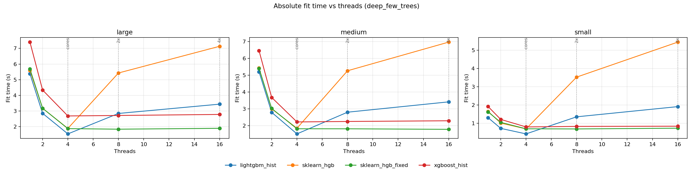

# Detailed platform analysis: linux-arm64

- System: `Linux`
- Architecture: `aarch64`
- CPU count (logical): `4`
- CPU count (physical): `4`
- Hyper-threading enabled: `False`
- CPU model: `Neoverse-N2`
- Core type counts: `{'performance': 4, 'efficiency': None, 'low_power': None}`
- CFS/CPU quota: `n/a`
- CPU set: `0-3`
- Thread grid: `[1, 2, 4, 8]`
- Native profile enabled: `True`

## Setting: `baseline_default`

_Vertical markers denote `cores=4` and `2x=8` thread regimes._

### Parity checks (thread=1)

| dataset | model | r2 | fitted_trees | expected_trees | trees_match | total_nodes | avg_nodes_per_tree |
| --- | --- | --- | --- | --- | --- | --- | --- |
| medium | lightgbm_hist | 0.66215 | 220 | 220 | True | 13326 | 60.5727 |
| medium | sklearn_hgb | 0.634085 | 220 | 220 | True | 13402 | 60.9182 |
| medium | sklearn_hgb_fixed | 0.634085 | 220 | 220 | True | 13402 | 60.9182 |
| medium | xgboost_hist | 0.661463 | 220 | 220 | True | 13336 | 60.6182 |
| small | lightgbm_hist | 0.949369 | 220 | 220 | True | 13386 | 60.8455 |
| small | sklearn_hgb | 0.942299 | 220 | 220 | True | 13414 | 60.9727 |
| small | sklearn_hgb_fixed | 0.942299 | 220 | 220 | True | 13414 | 60.9727 |
| small | xgboost_hist | 0.949753 | 220 | 220 | True | 13390 | 60.8636 |

### Scalability summary (`1 -> cores=4`)

| dataset | model | max_regular_threads | fit_s_1_thread | fit_s_regular_max_threads | speedup_1_to_regular_max |
| --- | --- | --- | --- | --- | --- |
| medium | lightgbm_hist | 4 | 1.87882 | 0.60123 | 3.12497 |
| medium | sklearn_hgb | 4 | 2.22961 | 0.925064 | 2.41022 |
| medium | sklearn_hgb_fixed | 4 | 2.2399 | 0.912514 | 2.45465 |
| medium | xgboost_hist | 4 | 3.33726 | 1.40735 | 2.3713 |
| small | lightgbm_hist | 4 | 0.537673 | 0.249644 | 2.15376 |
| small | sklearn_hgb | 4 | 0.7267 | 0.528934 | 1.3739 |
| small | sklearn_hgb_fixed | 4 | 0.725247 | 0.568062 | 1.2767 |
| small | xgboost_hist | 4 | 0.834146 | 0.444791 | 1.87537 |

### Oversubscription regime summary (`cores=4`, `2x`)

| dataset | model | fit_s_cores | fit_s_2x_cores | fit_ratio_2x_vs_cores |
| --- | --- | --- | --- | --- |
| medium | lightgbm_hist | 0.60123 | 1.61393 | 2.68437 |
| medium | sklearn_hgb | 0.925064 | 3.70485 | 4.00496 |
| medium | sklearn_hgb_fixed | 0.912514 | 0.886324 | 0.971298 |
| medium | xgboost_hist | 1.40735 | 1.46424 | 1.04042 |
| small | lightgbm_hist | 0.249644 | 1.07864 | 4.3207 |
| small | sklearn_hgb | 0.528934 | 3.15465 | 5.96416 |
| small | sklearn_hgb_fixed | 0.568062 | 0.555042 | 0.977079 |
| small | xgboost_hist | 0.444791 | 0.487439 | 1.09588 |

### Underperformance findings and root cause analysis

- Root cause signal: Python-level dispatch/orchestration contributes meaningfully to sklearn runtime.
- Issue (single_thread, dataset `medium`): Best sklearn total is 1.188x slower than best alternative at thread=1.
  - Implementation plan:
    - Move short-lived orchestration loops to Cython/C-level helpers.
    - Preallocate and reuse temporary buffers in split and histogram kernels.
    - Add lightweight fast paths for small-node splits to bypass heavy orchestration.
- Issue (single_thread, dataset `small`): Best sklearn total is 1.312x slower than best alternative at thread=1.
  - Implementation plan:
    - Move short-lived orchestration loops to Cython/C-level helpers.
    - Preallocate and reuse temporary buffers in split and histogram kernels.
    - Add lightweight fast paths for small-node splits to bypass heavy orchestration.
- Issue (scalability, dataset `medium`): Best sklearn speedup trails best alternative by 0.670 (1->regular max threads).
  - Implementation plan:
    - Move short-lived orchestration loops to Cython/C-level helpers.
    - Preallocate and reuse temporary buffers in split and histogram kernels.
    - Add lightweight fast paths for small-node splits to bypass heavy orchestration.
- Issue (scalability, dataset `small`): Best sklearn speedup trails best alternative by 0.780 (1->regular max threads).
  - Implementation plan:
    - Move short-lived orchestration loops to Cython/C-level helpers.
    - Preallocate and reuse temporary buffers in split and histogram kernels.
    - Add lightweight fast paths for small-node splits to bypass heavy orchestration.

## Setting: `deep_few_trees`

_Vertical markers denote `cores=4` and `2x=8` thread regimes._

### Parity checks (thread=1)

| dataset | model | r2 | fitted_trees | expected_trees | trees_match | total_nodes | avg_nodes_per_tree |
| --- | --- | --- | --- | --- | --- | --- | --- |
| large | lightgbm_hist | 0.491423 | 48 | 48 | True | 12144 | 253 |
| large | sklearn_hgb | 0.490287 | 48 | 48 | True | 12144 | 253 |
| large | sklearn_hgb_fixed | 0.490287 | 48 | 48 | True | 12144 | 253 |
| large | xgboost_hist | 0.491074 | 48 | 48 | True | 12144 | 253 |
| medium | lightgbm_hist | 0.56851 | 48 | 48 | True | 12144 | 253 |
| medium | sklearn_hgb | 0.568235 | 48 | 48 | True | 12144 | 253 |
| medium | sklearn_hgb_fixed | 0.568235 | 48 | 48 | True | 12144 | 253 |
| medium | xgboost_hist | 0.568178 | 48 | 48 | True | 12144 | 253 |
| small | lightgbm_hist | 0.749752 | 48 | 48 | True | 12144 | 253 |
| small | sklearn_hgb | 0.751461 | 48 | 48 | True | 12144 | 253 |
| small | sklearn_hgb_fixed | 0.751461 | 48 | 48 | True | 12144 | 253 |
| small | xgboost_hist | 0.752362 | 48 | 48 | True | 12144 | 253 |

### Scalability summary (`1 -> cores=4`)

| dataset | model | max_regular_threads | fit_s_1_thread | fit_s_regular_max_threads | speedup_1_to_regular_max |
| --- | --- | --- | --- | --- | --- |
| large | lightgbm_hist | 4 | 5.3734 | 1.53953 | 3.49028 |
| large | sklearn_hgb | 4 | 5.59087 | 1.88764 | 2.96184 |
| large | sklearn_hgb_fixed | 4 | 5.6837 | 1.87603 | 3.02964 |
| large | xgboost_hist | 4 | 7.40006 | 2.68574 | 2.75532 |
| medium | lightgbm_hist | 4 | 5.20613 | 1.5187 | 3.42802 |
| medium | sklearn_hgb | 4 | 5.42559 | 1.85345 | 2.92729 |
| medium | sklearn_hgb_fixed | 4 | 5.40072 | 1.82291 | 2.96269 |
| medium | xgboost_hist | 4 | 6.45764 | 2.22805 | 2.89834 |
| small | lightgbm_hist | 4 | 1.30788 | 0.420371 | 3.11125 |
| small | sklearn_hgb | 4 | 1.65148 | 0.694858 | 2.37671 |
| small | sklearn_hgb_fixed | 4 | 1.62532 | 0.699564 | 2.32333 |
| small | xgboost_hist | 4 | 1.9191 | 0.80161 | 2.39405 |

### Oversubscription regime summary (`cores=4`, `2x`)

| dataset | model | fit_s_cores | fit_s_2x_cores | fit_ratio_2x_vs_cores |
| --- | --- | --- | --- | --- |
| large | lightgbm_hist | 1.53953 | 2.84446 | 1.84762 |
| large | sklearn_hgb | 1.88764 | 5.42849 | 2.87581 |
| large | sklearn_hgb_fixed | 1.87603 | 1.84008 | 0.980836 |
| large | xgboost_hist | 2.68574 | 2.71607 | 1.01129 |
| medium | lightgbm_hist | 1.5187 | 2.80581 | 1.84751 |
| medium | sklearn_hgb | 1.85345 | 5.2636 | 2.83989 |
| medium | sklearn_hgb_fixed | 1.82291 | 1.82115 | 0.999033 |
| medium | xgboost_hist | 2.22805 | 2.25602 | 1.01255 |
| small | lightgbm_hist | 0.420371 | 1.35542 | 3.22435 |
| small | sklearn_hgb | 0.694858 | 3.52978 | 5.07986 |
| small | sklearn_hgb_fixed | 0.699564 | 0.691542 | 0.988534 |
| small | xgboost_hist | 0.80161 | 0.831167 | 1.03687 |

### Underperformance findings and root cause analysis

- Root cause signal: Python-level dispatch/orchestration contributes meaningfully to sklearn runtime.
- Issue (single_thread, dataset `small`): Best sklearn total is 1.224x slower than best alternative at thread=1.
  - Implementation plan:
    - Move short-lived orchestration loops to Cython/C-level helpers.
    - Preallocate and reuse temporary buffers in split and histogram kernels.
    - Add lightweight fast paths for small-node splits to bypass heavy orchestration.
- Issue (scalability, dataset `large`): Best sklearn speedup trails best alternative by 0.461 (1->regular max threads).
  - Implementation plan:
    - Move short-lived orchestration loops to Cython/C-level helpers.
    - Preallocate and reuse temporary buffers in split and histogram kernels.
    - Add lightweight fast paths for small-node splits to bypass heavy orchestration.
- Issue (scalability, dataset `medium`): Best sklearn speedup trails best alternative by 0.465 (1->regular max threads).
  - Implementation plan:
    - Move short-lived orchestration loops to Cython/C-level helpers.
    - Preallocate and reuse temporary buffers in split and histogram kernels.
    - Add lightweight fast paths for small-node splits to bypass heavy orchestration.
- Issue (scalability, dataset `small`): Best sklearn speedup trails best alternative by 0.735 (1->regular max threads).
  - Implementation plan:
    - Move short-lived orchestration loops to Cython/C-level helpers.
    - Preallocate and reuse temporary buffers in split and histogram kernels.
    - Add lightweight fast paths for small-node splits to bypass heavy orchestration.

