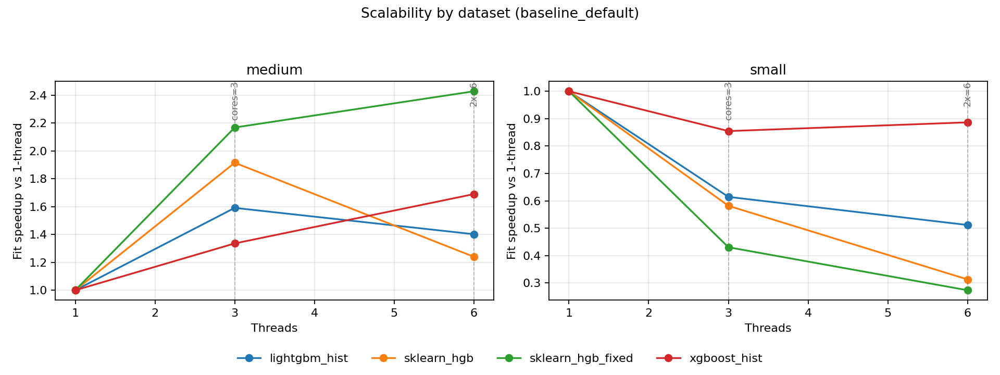
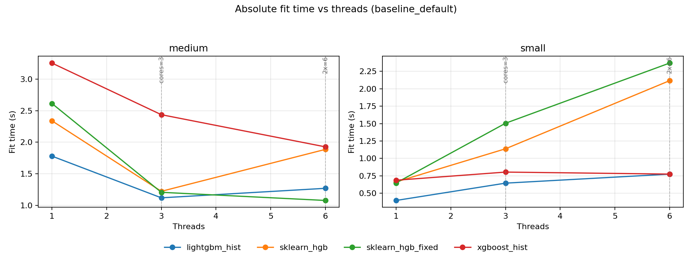
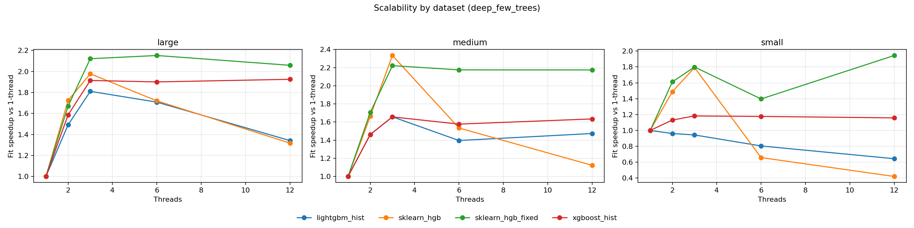
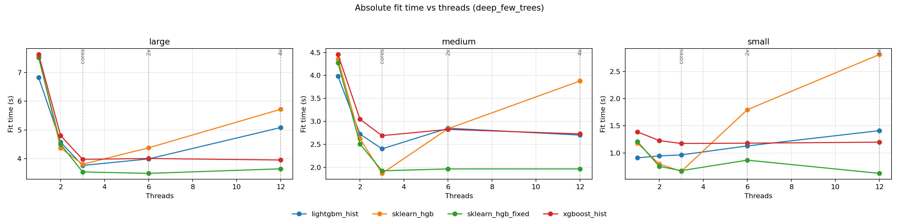

# Detailed platform analysis: macos-arm64

- System: `Darwin`
- Architecture: `arm64`
- CPU count (logical): `3`
- CPU count (physical): `3`
- Hyper-threading enabled: `False`
- CPU model: `Apple M1 (Virtual)`
- Core type counts: `{'performance': 3, 'efficiency': None, 'low_power': None}`
- CFS/CPU quota: `n/a`
- CPU set: `n/a`
- Thread grid: `[1, 3, 6]`
- Native profile enabled: `True`

## Setting: `baseline_default`

_Vertical markers denote `cores=3` and `2x=6` thread regimes._

### Parity checks (thread=1)

| dataset | model | r2 | fitted_trees | expected_trees | trees_match | total_nodes | avg_nodes_per_tree |
| --- | --- | --- | --- | --- | --- | --- | --- |
| medium | lightgbm_hist | 0.67228 | 220 | 220 | True | 13420 | 61 |
| medium | sklearn_hgb | 0.649317 | 220 | 220 | True | 13420 | 61 |
| medium | sklearn_hgb_fixed | 0.649317 | 220 | 220 | True | 13420 | 61 |
| medium | xgboost_hist | 0.67836 | 220 | 220 | True | 13420 | 61 |
| small | lightgbm_hist | 0.949369 | 220 | 220 | True | 13386 | 60.8455 |
| small | sklearn_hgb | 0.942299 | 220 | 220 | True | 13414 | 60.9727 |
| small | sklearn_hgb_fixed | 0.942299 | 220 | 220 | True | 13414 | 60.9727 |
| small | xgboost_hist | 0.949753 | 220 | 220 | True | 13390 | 60.8636 |

### Scalability summary (`1 -> cores=3`)

| dataset | model | max_regular_threads | fit_s_1_thread | fit_s_regular_max_threads | speedup_1_to_regular_max |
| --- | --- | --- | --- | --- | --- |
| medium | lightgbm_hist | 3 | 1.77952 | 1.11841 | 1.59112 |
| medium | sklearn_hgb | 3 | 2.33941 | 1.22159 | 1.91505 |
| medium | sklearn_hgb_fixed | 3 | 2.61405 | 1.2058 | 2.16789 |
| medium | xgboost_hist | 3 | 3.25455 | 2.43608 | 1.33598 |
| small | lightgbm_hist | 3 | 0.396159 | 0.64488 | 0.614315 |
| small | sklearn_hgb | 3 | 0.662144 | 1.13828 | 0.581706 |
| small | sklearn_hgb_fixed | 3 | 0.647791 | 1.50518 | 0.430373 |
| small | xgboost_hist | 3 | 0.686883 | 0.803683 | 0.854669 |

### Oversubscription regime summary (`cores=3`, `2x`)

| dataset | model | fit_s_cores | fit_s_2x_cores | fit_ratio_2x_vs_cores |
| --- | --- | --- | --- | --- |
| medium | lightgbm_hist | 1.11841 | 1.26918 | 1.13481 |
| medium | sklearn_hgb | 1.22159 | 1.88643 | 1.54424 |
| medium | sklearn_hgb_fixed | 1.2058 | 1.07665 | 0.892887 |
| medium | xgboost_hist | 2.43608 | 1.92588 | 0.790565 |
| small | lightgbm_hist | 0.64488 | 0.7743 | 1.20069 |
| small | sklearn_hgb | 1.13828 | 2.11685 | 1.85969 |
| small | sklearn_hgb_fixed | 1.50518 | 2.36966 | 1.57433 |
| small | xgboost_hist | 0.803683 | 0.774822 | 0.964089 |

### Underperformance findings and root cause analysis

- Root cause signal: Python-level dispatch/orchestration contributes meaningfully to sklearn runtime.
- Issue (single_thread, dataset `medium`): Best sklearn total is 1.284x slower than best alternative at thread=1.
  - Implementation plan:
    - Move short-lived orchestration loops to Cython/C-level helpers.
    - Preallocate and reuse temporary buffers in split and histogram kernels.
    - Add lightweight fast paths for small-node splits to bypass heavy orchestration.
- Issue (single_thread, dataset `small`): Best sklearn total is 1.588x slower than best alternative at thread=1.
  - Implementation plan:
    - Move short-lived orchestration loops to Cython/C-level helpers.
    - Preallocate and reuse temporary buffers in split and histogram kernels.
    - Add lightweight fast paths for small-node splits to bypass heavy orchestration.
- Issue (scalability, dataset `small`): Best sklearn speedup trails best alternative by 0.273 (1->regular max threads).
  - Implementation plan:
    - Move short-lived orchestration loops to Cython/C-level helpers.
    - Preallocate and reuse temporary buffers in split and histogram kernels.
    - Add lightweight fast paths for small-node splits to bypass heavy orchestration.
- Issue (oversubscription, dataset `small`): At 2x cores, sklearn fit-time ratio vs cores is 1.860 vs 1.201 for best alternative.
  - Implementation plan:
    - Move short-lived orchestration loops to Cython/C-level helpers.
    - Preallocate and reuse temporary buffers in split and histogram kernels.
    - Add lightweight fast paths for small-node splits to bypass heavy orchestration.

## Setting: `deep_few_trees`

_Vertical markers denote `cores=3` and `2x=6` thread regimes._

### Parity checks (thread=1)

| dataset | model | r2 | fitted_trees | expected_trees | trees_match | total_nodes | avg_nodes_per_tree |
| --- | --- | --- | --- | --- | --- | --- | --- |
| large | lightgbm_hist | 0.490012 | 48 | 48 | True | 12144 | 253 |
| large | sklearn_hgb | 0.488521 | 48 | 48 | True | 12144 | 253 |
| large | sklearn_hgb_fixed | 0.488521 | 48 | 48 | True | 12144 | 253 |
| large | xgboost_hist | 0.489088 | 48 | 48 | True | 12144 | 253 |
| medium | lightgbm_hist | 0.56851 | 48 | 48 | True | 12144 | 253 |
| medium | sklearn_hgb | 0.568235 | 48 | 48 | True | 12144 | 253 |
| medium | sklearn_hgb_fixed | 0.568235 | 48 | 48 | True | 12144 | 253 |
| medium | xgboost_hist | 0.568178 | 48 | 48 | True | 12144 | 253 |
| small | lightgbm_hist | 0.749752 | 48 | 48 | True | 12144 | 253 |
| small | sklearn_hgb | 0.751461 | 48 | 48 | True | 12144 | 253 |
| small | sklearn_hgb_fixed | 0.751461 | 48 | 48 | True | 12144 | 253 |
| small | xgboost_hist | 0.752362 | 48 | 48 | True | 12144 | 253 |

### Scalability summary (`1 -> cores=3`)

| dataset | model | max_regular_threads | fit_s_1_thread | fit_s_regular_max_threads | speedup_1_to_regular_max |
| --- | --- | --- | --- | --- | --- |
| large | lightgbm_hist | 3 | 6.82629 | 3.76954 | 1.81091 |
| large | sklearn_hgb | 3 | 7.53978 | 3.81173 | 1.97804 |
| large | sklearn_hgb_fixed | 3 | 7.52049 | 3.54489 | 2.1215 |
| large | xgboost_hist | 3 | 7.62314 | 3.98212 | 1.91434 |
| medium | lightgbm_hist | 3 | 3.98004 | 2.4007 | 1.65787 |
| medium | sklearn_hgb | 3 | 4.35726 | 1.86695 | 2.33389 |
| medium | sklearn_hgb_fixed | 3 | 4.27206 | 1.92269 | 2.22191 |
| medium | xgboost_hist | 3 | 4.45558 | 2.6892 | 1.65684 |
| small | lightgbm_hist | 3 | 0.909141 | 0.963743 | 0.943343 |
| small | sklearn_hgb | 3 | 1.18348 | 0.660433 | 1.79198 |
| small | sklearn_hgb_fixed | 3 | 1.21143 | 0.673212 | 1.79947 |
| small | xgboost_hist | 3 | 1.38894 | 1.17422 | 1.18286 |

### Oversubscription regime summary (`cores=3`, `2x`)

| dataset | model | fit_s_cores | fit_s_2x_cores | fit_ratio_2x_vs_cores |
| --- | --- | --- | --- | --- |
| large | lightgbm_hist | 3.76954 | 3.99649 | 1.06021 |
| large | sklearn_hgb | 3.81173 | 4.38256 | 1.14975 |
| large | sklearn_hgb_fixed | 3.54489 | 3.49424 | 0.985713 |
| large | xgboost_hist | 3.98212 | 4.01096 | 1.00724 |
| medium | lightgbm_hist | 2.4007 | 2.8501 | 1.1872 |
| medium | sklearn_hgb | 1.86695 | 2.83968 | 1.52102 |
| medium | sklearn_hgb_fixed | 1.92269 | 1.96379 | 1.02137 |
| medium | xgboost_hist | 2.6892 | 2.8247 | 1.05039 |
| small | lightgbm_hist | 0.963743 | 1.1298 | 1.1723 |
| small | sklearn_hgb | 0.660433 | 1.79805 | 2.72253 |
| small | sklearn_hgb_fixed | 0.673212 | 0.867231 | 1.2882 |
| small | xgboost_hist | 1.17422 | 1.18025 | 1.00513 |

### Underperformance findings and root cause analysis

- Root cause signal: Python-level dispatch/orchestration contributes meaningfully to sklearn runtime.
- Issue (single_thread, dataset `large`): Best sklearn total is 1.096x slower than best alternative at thread=1.
  - Implementation plan:
    - Move short-lived orchestration loops to Cython/C-level helpers.
    - Preallocate and reuse temporary buffers in split and histogram kernels.
    - Add lightweight fast paths for small-node splits to bypass heavy orchestration.
- Issue (single_thread, dataset `medium`): Best sklearn total is 1.070x slower than best alternative at thread=1.
  - Implementation plan:
    - Move short-lived orchestration loops to Cython/C-level helpers.
    - Preallocate and reuse temporary buffers in split and histogram kernels.
    - Add lightweight fast paths for small-node splits to bypass heavy orchestration.
- Issue (single_thread, dataset `small`): Best sklearn total is 1.296x slower than best alternative at thread=1.
  - Implementation plan:
    - Move short-lived orchestration loops to Cython/C-level helpers.
    - Preallocate and reuse temporary buffers in split and histogram kernels.
    - Add lightweight fast paths for small-node splits to bypass heavy orchestration.

