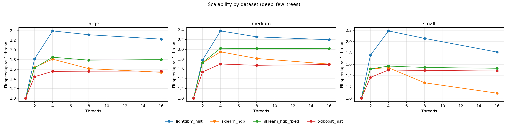
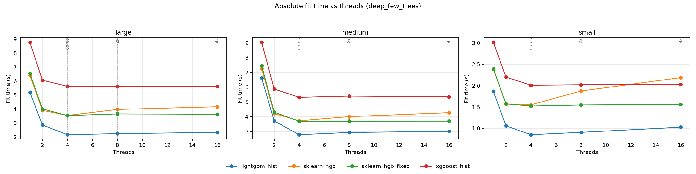

# Detailed platform analysis: windows-amd64

- System: `Windows`
- Architecture: `AMD64`
- CPU count (logical): `4`
- CPU count (physical): `2`
- Hyper-threading enabled: `True`
- CPU model: `AMD EPYC 9V74 80-Core Processor`
- Core type counts: `{'performance': None, 'efficiency': None, 'low_power': None}`
- CFS/CPU quota: `n/a`
- CPU set: `n/a`
- Thread grid: `[1, 2, 4, 8, 16]`
- Native profile enabled: `False`

## Setting: `baseline_default`

_Vertical markers denote `cores=4`, `2x=8`, and `4x=16` thread regimes._

### Parity checks (thread=1)

| dataset | model | r2 | fitted_trees | expected_trees | trees_match | total_nodes | avg_nodes_per_tree |
| --- | --- | --- | --- | --- | --- | --- | --- |
| large | lightgbm_hist | 0.692337 | 220 | 220 | True | 13420 | 61 |
| large | sklearn_hgb | 0.675577 | 220 | 220 | True | 13420 | 61 |
| large | sklearn_hgb_fixed | 0.675577 | 220 | 220 | True | 13420 | 61 |
| large | xgboost_hist | 0.694704 | 220 | 220 | True | 13420 | 61 |
| medium | lightgbm_hist | 0.79359 | 220 | 220 | True | 13420 | 61 |
| medium | sklearn_hgb | 0.785099 | 220 | 220 | True | 13420 | 61 |
| medium | sklearn_hgb_fixed | 0.785099 | 220 | 220 | True | 13420 | 61 |
| medium | xgboost_hist | 0.793602 | 220 | 220 | True | 13420 | 61 |
| small | lightgbm_hist | 0.893078 | 220 | 220 | True | 13420 | 61 |
| small | sklearn_hgb | 0.88762 | 220 | 220 | True | 13420 | 61 |
| small | sklearn_hgb_fixed | 0.88762 | 220 | 220 | True | 13420 | 61 |
| small | xgboost_hist | 0.893059 | 220 | 220 | True | 13420 | 61 |

### Scalability summary (`1 -> cores=4`)

| dataset | model | max_regular_threads | fit_s_1_thread | fit_s_regular_max_threads | speedup_1_to_regular_max |
| --- | --- | --- | --- | --- | --- |
| large | lightgbm_hist | 4 | 6.49309 | 2.7477 | 2.36311 |
| large | sklearn_hgb | 4 | 7.68034 | 3.95861 | 1.94016 |
| large | sklearn_hgb_fixed | 4 | 7.67244 | 4.00564 | 1.91541 |
| large | xgboost_hist | 4 | 9.33896 | 5.09251 | 1.83386 |
| medium | lightgbm_hist | 4 | 6.04011 | 2.61256 | 2.31195 |
| medium | sklearn_hgb | 4 | 6.75536 | 3.45673 | 1.95426 |
| medium | sklearn_hgb_fixed | 4 | 6.76673 | 3.53761 | 1.9128 |
| medium | xgboost_hist | 4 | 8.19298 | 4.37824 | 1.87129 |
| small | lightgbm_hist | 4 | 2.56243 | 1.13828 | 2.25115 |
| small | sklearn_hgb | 4 | 3.02075 | 1.7056 | 1.77108 |
| small | sklearn_hgb_fixed | 4 | 3.27314 | 1.73759 | 1.88373 |
| small | xgboost_hist | 4 | 3.59205 | 1.96482 | 1.82819 |

### Oversubscription regime summary (`cores=4`, `2x`, `4x`)

| dataset | model | fit_s_cores | fit_s_2x_cores | fit_s_4x_cores | fit_ratio_2x_vs_cores | fit_ratio_4x_vs_cores |
| --- | --- | --- | --- | --- | --- | --- |
| large | lightgbm_hist | 2.7477 | 2.86144 | 3.02242 | 1.0414 | 1.09999 |
| large | sklearn_hgb | 3.95861 | 4.24635 | 4.76002 | 1.07269 | 1.20245 |
| large | sklearn_hgb_fixed | 4.00564 | 3.94976 | 4.09991 | 0.98605 | 1.02353 |
| large | xgboost_hist | 5.09251 | 5.03796 | 5.08123 | 0.989287 | 0.997784 |
| medium | lightgbm_hist | 2.61256 | 2.70981 | 2.81507 | 1.03722 | 1.07751 |
| medium | sklearn_hgb | 3.45673 | 3.75537 | 4.04277 | 1.08639 | 1.16954 |
| medium | sklearn_hgb_fixed | 3.53761 | 3.44179 | 4.19042 | 0.972914 | 1.18454 |
| medium | xgboost_hist | 4.37824 | 4.35594 | 4.38673 | 0.994905 | 1.00194 |
| small | lightgbm_hist | 1.13828 | 1.24285 | 1.37231 | 1.09187 | 1.20561 |
| small | sklearn_hgb | 1.7056 | 2.03888 | 2.34094 | 1.1954 | 1.3725 |
| small | sklearn_hgb_fixed | 1.73759 | 1.74484 | 1.74405 | 1.00418 | 1.00372 |
| small | xgboost_hist | 1.96482 | 1.96648 | 1.99751 | 1.00084 | 1.01664 |

### Underperformance findings and root cause analysis

- Root cause signal: Python-level dispatch/orchestration contributes meaningfully to sklearn runtime.
- Issue (single_thread, dataset `large`): Best sklearn total is 1.216x slower than best alternative at thread=1.
  - Implementation plan:
    - Move short-lived orchestration loops to Cython/C-level helpers.
    - Preallocate and reuse temporary buffers in split and histogram kernels.
    - Add lightweight fast paths for small-node splits to bypass heavy orchestration.
- Issue (single_thread, dataset `medium`): Best sklearn total is 1.157x slower than best alternative at thread=1.
  - Implementation plan:
    - Move short-lived orchestration loops to Cython/C-level helpers.
    - Preallocate and reuse temporary buffers in split and histogram kernels.
    - Add lightweight fast paths for small-node splits to bypass heavy orchestration.
- Issue (single_thread, dataset `small`): Best sklearn total is 1.220x slower than best alternative at thread=1.
  - Implementation plan:
    - Move short-lived orchestration loops to Cython/C-level helpers.
    - Preallocate and reuse temporary buffers in split and histogram kernels.
    - Add lightweight fast paths for small-node splits to bypass heavy orchestration.
- Issue (scalability, dataset `large`): Best sklearn speedup trails best alternative by 0.423 (1->regular max threads).
  - Implementation plan:
    - Move short-lived orchestration loops to Cython/C-level helpers.
    - Preallocate and reuse temporary buffers in split and histogram kernels.
    - Add lightweight fast paths for small-node splits to bypass heavy orchestration.
- Issue (scalability, dataset `medium`): Best sklearn speedup trails best alternative by 0.358 (1->regular max threads).
  - Implementation plan:
    - Move short-lived orchestration loops to Cython/C-level helpers.
    - Preallocate and reuse temporary buffers in split and histogram kernels.
    - Add lightweight fast paths for small-node splits to bypass heavy orchestration.
- Issue (scalability, dataset `small`): Best sklearn speedup trails best alternative by 0.367 (1->regular max threads).
  - Implementation plan:
    - Move short-lived orchestration loops to Cython/C-level helpers.
    - Preallocate and reuse temporary buffers in split and histogram kernels.
    - Add lightweight fast paths for small-node splits to bypass heavy orchestration.

## Setting: `deep_few_trees`

_Vertical markers denote `cores=4`, `2x=8`, and `4x=16` thread regimes._

### Parity checks (thread=1)

| dataset | model | r2 | fitted_trees | expected_trees | trees_match | total_nodes | avg_nodes_per_tree |
| --- | --- | --- | --- | --- | --- | --- | --- |
| large | lightgbm_hist | 0.507257 | 48 | 48 | True | 12144 | 253 |
| large | sklearn_hgb | 0.504162 | 48 | 48 | True | 12144 | 253 |
| large | sklearn_hgb_fixed | 0.504162 | 48 | 48 | True | 12144 | 253 |
| large | xgboost_hist | 0.504185 | 48 | 48 | True | 12144 | 253 |
| medium | lightgbm_hist | 0.56851 | 48 | 48 | True | 12144 | 253 |
| medium | sklearn_hgb | 0.568235 | 48 | 48 | True | 12144 | 253 |
| medium | sklearn_hgb_fixed | 0.568235 | 48 | 48 | True | 12144 | 253 |
| medium | xgboost_hist | 0.568178 | 48 | 48 | True | 12144 | 253 |
| small | lightgbm_hist | 0.749752 | 48 | 48 | True | 12144 | 253 |
| small | sklearn_hgb | 0.751461 | 48 | 48 | True | 12144 | 253 |
| small | sklearn_hgb_fixed | 0.751461 | 48 | 48 | True | 12144 | 253 |
| small | xgboost_hist | 0.752362 | 48 | 48 | True | 12144 | 253 |

### Scalability summary (`1 -> cores=4`)

| dataset | model | max_regular_threads | fit_s_1_thread | fit_s_regular_max_threads | speedup_1_to_regular_max |
| --- | --- | --- | --- | --- | --- |
| large | lightgbm_hist | 4 | 5.1992 | 2.17188 | 2.39387 |
| large | sklearn_hgb | 4 | 6.41499 | 3.54537 | 1.8094 |
| large | sklearn_hgb_fixed | 4 | 6.54147 | 3.53694 | 1.84947 |
| large | xgboost_hist | 4 | 8.77577 | 5.63424 | 1.55758 |
| medium | lightgbm_hist | 4 | 6.62576 | 2.78701 | 2.37737 |
| medium | sklearn_hgb | 4 | 7.27094 | 3.72931 | 1.94967 |
| medium | sklearn_hgb_fixed | 4 | 7.46591 | 3.69216 | 2.0221 |
| medium | xgboost_hist | 4 | 9.04595 | 5.31736 | 1.70121 |
| small | lightgbm_hist | 4 | 1.86703 | 0.852749 | 2.18942 |
| small | sklearn_hgb | 4 | 2.3882 | 1.55149 | 1.53929 |
| small | sklearn_hgb_fixed | 4 | 2.39185 | 1.52459 | 1.56884 |
| small | xgboost_hist | 4 | 3.01496 | 2.0111 | 1.49915 |

### Oversubscription regime summary (`cores=4`, `2x`, `4x`)

| dataset | model | fit_s_cores | fit_s_2x_cores | fit_s_4x_cores | fit_ratio_2x_vs_cores | fit_ratio_4x_vs_cores |
| --- | --- | --- | --- | --- | --- | --- |
| large | lightgbm_hist | 2.17188 | 2.2459 | 2.33808 | 1.03408 | 1.07652 |
| large | sklearn_hgb | 3.54537 | 3.97659 | 4.17252 | 1.12163 | 1.17689 |
| large | sklearn_hgb_fixed | 3.53694 | 3.65635 | 3.63412 | 1.03376 | 1.02748 |
| large | xgboost_hist | 5.63424 | 5.6238 | 5.61747 | 0.998147 | 0.997023 |
| medium | lightgbm_hist | 2.78701 | 2.93674 | 3.01534 | 1.05373 | 1.08193 |
| medium | sklearn_hgb | 3.72931 | 4.00856 | 4.27832 | 1.07488 | 1.14721 |
| medium | sklearn_hgb_fixed | 3.69216 | 3.70269 | 3.70564 | 1.00285 | 1.00365 |
| medium | xgboost_hist | 5.31736 | 5.40338 | 5.35435 | 1.01618 | 1.00696 |
| small | lightgbm_hist | 0.852749 | 0.907564 | 1.02793 | 1.06428 | 1.20543 |
| small | sklearn_hgb | 1.55149 | 1.87453 | 2.18997 | 1.20821 | 1.41152 |
| small | sklearn_hgb_fixed | 1.52459 | 1.54887 | 1.56357 | 1.01592 | 1.02557 |
| small | xgboost_hist | 2.0111 | 2.02142 | 2.03434 | 1.00513 | 1.01156 |

### Underperformance findings and root cause analysis

- Root cause signal: Python-level dispatch/orchestration contributes meaningfully to sklearn runtime.
- Issue (single_thread, dataset `large`): Best sklearn total is 1.248x slower than best alternative at thread=1.
  - Implementation plan:
    - Move short-lived orchestration loops to Cython/C-level helpers.
    - Preallocate and reuse temporary buffers in split and histogram kernels.
    - Add lightweight fast paths for small-node splits to bypass heavy orchestration.
- Issue (single_thread, dataset `medium`): Best sklearn total is 1.117x slower than best alternative at thread=1.
  - Implementation plan:
    - Move short-lived orchestration loops to Cython/C-level helpers.
    - Preallocate and reuse temporary buffers in split and histogram kernels.
    - Add lightweight fast paths for small-node splits to bypass heavy orchestration.
- Issue (single_thread, dataset `small`): Best sklearn total is 1.294x slower than best alternative at thread=1.
  - Implementation plan:
    - Move short-lived orchestration loops to Cython/C-level helpers.
    - Preallocate and reuse temporary buffers in split and histogram kernels.
    - Add lightweight fast paths for small-node splits to bypass heavy orchestration.
- Issue (scalability, dataset `large`): Best sklearn speedup trails best alternative by 0.544 (1->regular max threads).
  - Implementation plan:
    - Move short-lived orchestration loops to Cython/C-level helpers.
    - Preallocate and reuse temporary buffers in split and histogram kernels.
    - Add lightweight fast paths for small-node splits to bypass heavy orchestration.
- Issue (scalability, dataset `medium`): Best sklearn speedup trails best alternative by 0.355 (1->regular max threads).
  - Implementation plan:
    - Move short-lived orchestration loops to Cython/C-level helpers.
    - Preallocate and reuse temporary buffers in split and histogram kernels.
    - Add lightweight fast paths for small-node splits to bypass heavy orchestration.
- Issue (scalability, dataset `small`): Best sklearn speedup trails best alternative by 0.621 (1->regular max threads).
  - Implementation plan:
    - Move short-lived orchestration loops to Cython/C-level helpers.
    - Preallocate and reuse temporary buffers in split and histogram kernels.
    - Add lightweight fast paths for small-node splits to bypass heavy orchestration.

