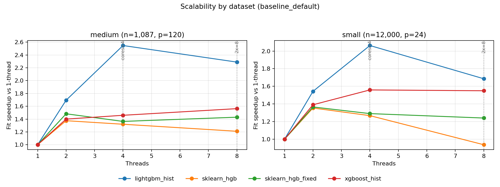
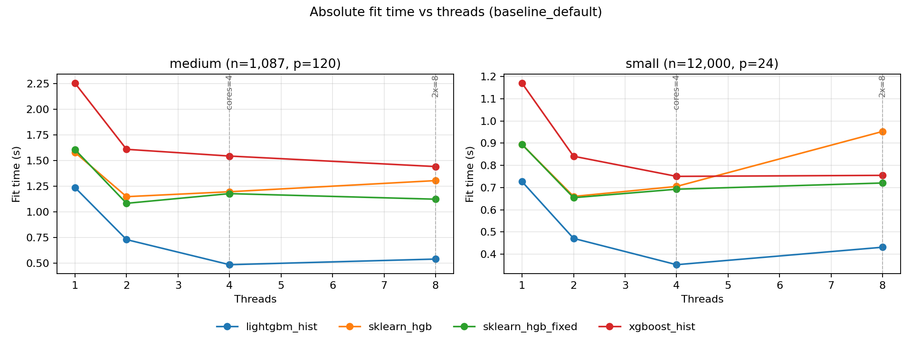

# Detailed platform analysis: windows-amd64

- System: `Windows`
- Architecture: `AMD64`
- CPU count (logical): `4`
- CPU count (physical): `2`
- Hyper-threading enabled: `True`
- CPU model: `AMD EPYC 7763 64-Core Processor`
- Core type counts: `{'performance': None, 'efficiency': None, 'low_power': None}`
- CFS/CPU quota: `n/a`
- CPU set: `n/a`
- Thread grid: `[1, 2, 4, 8]`
- Native profile enabled: `False`

## Setting: `baseline_default`

_Vertical markers denote `cores=4` and `2x=8` thread regimes._

### Parity checks (thread=1)

| dataset | model | r2 | fitted_trees | expected_trees | trees_match | total_nodes | avg_nodes_per_tree |
| --- | --- | --- | --- | --- | --- | --- | --- |
| medium | lightgbm_hist | 0.553503 | 220 | 220 | True | 8646 | 39.3 |
| medium | sklearn_hgb | 0.499169 | 220 | 220 | True | 9918 | 45.0818 |
| medium | sklearn_hgb_fixed | 0.499169 | 220 | 220 | True | 9918 | 45.0818 |
| medium | xgboost_hist | 0.549615 | 220 | 220 | True | 8638 | 39.2636 |
| small | lightgbm_hist | 0.949369 | 220 | 220 | True | 13386 | 60.8455 |
| small | sklearn_hgb | 0.942299 | 220 | 220 | True | 13414 | 60.9727 |
| small | sklearn_hgb_fixed | 0.942299 | 220 | 220 | True | 13414 | 60.9727 |
| small | xgboost_hist | 0.948866 | 220 | 220 | True | 13394 | 60.8818 |

### Scalability summary (`1 -> cores=4`)

| dataset | model | max_regular_threads | fit_s_1_thread | fit_s_regular_max_threads | speedup_1_to_regular_max |
| --- | --- | --- | --- | --- | --- |
| medium | lightgbm_hist | 4 | 1.23696 | 0.485516 | 2.54772 |
| medium | sklearn_hgb | 4 | 1.57912 | 1.19665 | 1.31962 |
| medium | sklearn_hgb_fixed | 4 | 1.60684 | 1.17824 | 1.36377 |
| medium | xgboost_hist | 4 | 2.2539 | 1.54441 | 1.45939 |
| small | lightgbm_hist | 4 | 0.726625 | 0.352282 | 2.06262 |
| small | sklearn_hgb | 4 | 0.893799 | 0.70497 | 1.26785 |
| small | sklearn_hgb_fixed | 4 | 0.893914 | 0.69246 | 1.29093 |
| small | xgboost_hist | 4 | 1.16996 | 0.75033 | 1.55926 |

### Oversubscription regime summary (`cores=4`, `2x`)

| dataset | model | fit_s_cores | fit_s_2x_cores | fit_ratio_2x_vs_cores |
| --- | --- | --- | --- | --- |
| medium | lightgbm_hist | 0.485516 | 0.540367 | 1.11297 |
| medium | sklearn_hgb | 1.19665 | 1.30508 | 1.09061 |
| medium | sklearn_hgb_fixed | 1.17824 | 1.1239 | 0.953882 |
| medium | xgboost_hist | 1.54441 | 1.442 | 0.933692 |
| small | lightgbm_hist | 0.352282 | 0.430999 | 1.22345 |
| small | sklearn_hgb | 0.70497 | 0.952779 | 1.35152 |
| small | sklearn_hgb_fixed | 0.69246 | 0.720475 | 1.04046 |
| small | xgboost_hist | 0.75033 | 0.754889 | 1.00608 |

### Underperformance findings and root cause analysis

- Root cause signal: Python-level dispatch/orchestration contributes meaningfully to sklearn runtime.
- Issue (single_thread, dataset `medium`): Best sklearn total is 1.202x slower than best alternative at thread=1.
  - Implementation plan:
    - Move short-lived orchestration loops to Cython/C-level helpers.
    - Preallocate and reuse temporary buffers in split and histogram kernels.
    - Add lightweight fast paths for small-node splits to bypass heavy orchestration.
- Issue (single_thread, dataset `small`): Best sklearn total is 1.389x slower than best alternative at thread=1.
  - Implementation plan:
    - Move short-lived orchestration loops to Cython/C-level helpers.
    - Preallocate and reuse temporary buffers in split and histogram kernels.
    - Add lightweight fast paths for small-node splits to bypass heavy orchestration.
- Issue (scalability, dataset `medium`): Best sklearn speedup trails best alternative by 1.184 (1->regular max threads).
  - Implementation plan:
    - Move short-lived orchestration loops to Cython/C-level helpers.
    - Preallocate and reuse temporary buffers in split and histogram kernels.
    - Add lightweight fast paths for small-node splits to bypass heavy orchestration.
- Issue (scalability, dataset `small`): Best sklearn speedup trails best alternative by 0.772 (1->regular max threads).
  - Implementation plan:
    - Move short-lived orchestration loops to Cython/C-level helpers.
    - Preallocate and reuse temporary buffers in split and histogram kernels.
    - Add lightweight fast paths for small-node splits to bypass heavy orchestration.

